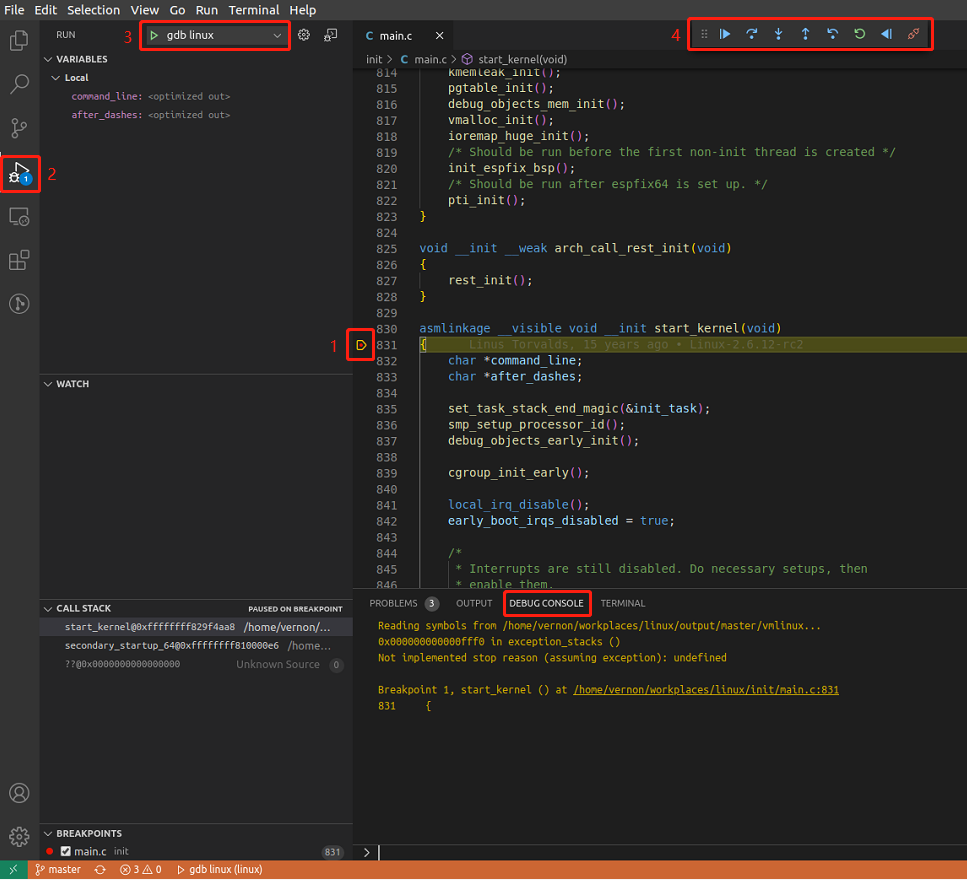

> 此文档属于实践类文档

## 1. 调试

为了跟踪linux kernel的函数调用关系，可以用gdb一步一步跟踪，直观得到函数的调用关系

但是gdb是命令行工具，不容易操作，vscode可以通过安装Native Debug插件实现gdb所有操作，简单方便。

### 例子1：通过gdb调试linux kernel

调用qemu-system-x86_64 -s -S进入DEBUG模式

```bash
$ qemu-system-x86_64 -nographic -M pc -kernel bzImage -drive file=rootfs.ext4,if=ide,format=raw -append "root=/dev/sda console=ttyS0" -s -S
```

执行gdb

```bash
$ gdb vmlinux
Reading symbols from vmlinux...
(gdb) target remote localhost:1234
(gdb) b start_kernel # 在start_kernel()设置断点
(gdb) c              # 继续运行linux kernel，直到遇到断点
```

### 例子2：通过vscode Native Debug插件调试linux kernel（推荐）

创建launch.json

```json
$ cat .vscode/launch.json
{
    "version": "0.2.0",
    "configurations": [
        {
            "type": "gdb",
            "request": "attach",
            "name": "gdb linux",
            "executable": "vmlinux",
            "target": "localhost:1234",
            "remote": true,
            "cwd": "${workspaceRoot}",
            "valuesFormatting": "parseText"
        }
    ]
}
```

调用qemu-system-x86_64 -s -S进入DEBUG模式

```bash
$ qemu-system-x86_64 -nographic -M pc -kernel bzImage -drive file=rootfs.ext4,if=ide,format=raw -append "root=/dev/sda console=ttyS0" -s -S
```

执行vscode Native Debug插件



如图所示，首先在start_kernel()设置断点，其次执行vscode Native Debug插件，最后通过F5（continue）、F10（next）、F11（step）进行源码级调试。

在DEBUG CONSOLE窗口中，可以执行gdb命令，如b, c, n, lx-version, lx-dmesg等等

## 2. 源码阅读

有时候想要跟踪linux kernel的函数调用关系，但是不方便进行gdb调试，需要直接阅读linux kernel源码，此时需要IDE能够对函数调用和结构体进行跳转以及自动补全

### 例子1：通过vscode C/C++插件（推荐）

创建`settings.json`

```bash
$ cat .vscode/settings.json
{
    "C_Cpp.default.compileCommands": "compile_commands.json",
    "json.maxItemsComputed": 15000
}
```

生成`compile_commands.json`

**A. 第一种情况**

在linux4.19 or laster中，linux kernel自带可以生成`compile_commands.json`的python脚本

```bash
## based linux5.4
$ cd linux
$ make ARCH=x86 x86_64_defconfig
$ make ARCH=x86                     ## 编译生成bzImage以及autoconf.h
$ ./scripts/gen_compile_commands.py ## 生成compile_commands.json
```

**B. 第二种情况**

旧版本的linux kernel没有自带可以生成`compile_commands.json`的python脚本，比如`linux2.6.34`，我们可以使用`compiledb`命令进行生成

更多关于`compiledb`详细解释，请看[官方](https://github.com/nickdiego/compiledb)

```bash
## based linux2.6.34
$ cd linux
$ make ARCH=x86 x86_64_defconfig
$ compiledb -n --command-style make ARCH=x86 ## 生成compile_commands.json
$ make ARCH=x86                              ## 编译生成bzImage以及autoconf.h

$ compiledb -h
Usage: compiledb [OPTIONS] COMMAND [ARGS]...

  Clang's Compilation Database generator for make-based build systems. When
  no subcommand is used it will parse build log/commands and generates its
  corresponding Compilation database.

Options:
  -n, --no-build         Only generates compilation db file.
  --command-style        Output compilation database with single "command"
                         string rather than the default "arguments" list of
                         strings.
```

打开vscode即可，直接对函数调用和结构体进行跳转以及自动补全

### 例子2：GNU global

ubuntu安装GNU global

```bash
$ sudo apt install global
```

安装后生成如下命令

- gtags  : 生成GNU global的数据库
- global : 查询
- gtags-cscope : 与cscope一样的界面

linux kernel生成GNU global的数据库

```bash
$ make ALLSOURCE_ARCHS=arm gtags # 只生成arm的数据库
或
$ gtags                          # 不建议使用，默认会生成所有arch的数据库
```

生成如下文件

- GTAGS   : definition database
- GRTAGS:  reference database
- GPATH  :  path name database

查询

**Ａ. 通过shell global命令进行查询**

```bash
$ global <funcName>    # 查找函数定义
$ global -r <funcName> # 查找函数调用
或
## -x : 使用标准ctags格式显示结果
$ global -x <funcName>
$ global -rx <funcName>
```

**Ｂ. 通过vim gtags-cscope 进行查询**

```bash
vim test.c

# 在vim命令行模式，输入如下
:set cscopeprg=gtags-cscope
:cs add GTAGS
:cs find g <funcName> # 查找函数定义
:cs find c <funcName> # 查找函数调用
```

**Ｃ. 通过vscode C/C++ GNU Global插件进行查询（推荐）**


参考网址 : [GNU GLOBAL Source Code Tag System](https://www.gnu.org/software/global/globaldoc.html)

### 例子3：cscope

ubuntu安装cscope

```bash
$ sudo apt install cscope
```

linux kernel生成cscope的数据库

```bash
$ make ALLSOURCE_ARCHS=arm cscope # 只生成arm的数据库
或
$ cscope -b -q -k -f cscope.out   # 不建议使用，默认会生成所有arch的数据库
```

查询

**A. 通过vim进行查询**

```bash
vim test.c

# 在vim命令行模式，输入如下
:cscope add cscope.out
:cs find g <funcName> # 查找函数定义
:cs find c <funcName> # 查找函数调用
```

**B. 通过vscode scope4code插件进行查询（推荐）**

同时进行如下配置：

```bash
"scope4code.databasePath": "${workspaceRoot}/",
"scope4code.engineCommands": {
	"config_index": {
        "cscope": {
            "linux": 0
        }
    },
    "config": [
        {
            "find_cmd": "find ${src_path} -type f -name *.c -o -type f -name *.h -o -type f -name *.cpp -o -type f -name *.cc -o -type f -name *.mm",
            // "database_cmd": "cscope -b -q -k -f cscope.out",
            "database_cmd": "make ARCH=x86 cscope",
            "find_all_ref": "cscope -q -k -L0 ${text}",
            "find_define": "cscope -q -k -L1 ${text}",
            "find_callee": "cscope -q -k -L2 ${text}",
            "find_caller": "cscope -q -k -L3 ${text}",
            "find_text": "cscope -q -k -L4 ${text}"
        }
    ]
}
```

