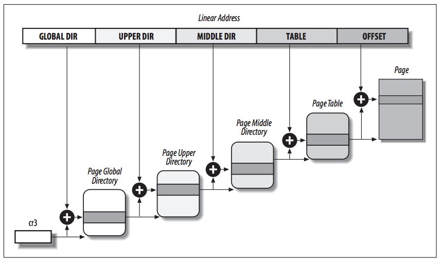
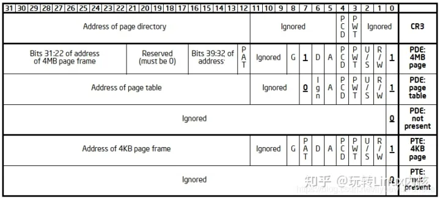
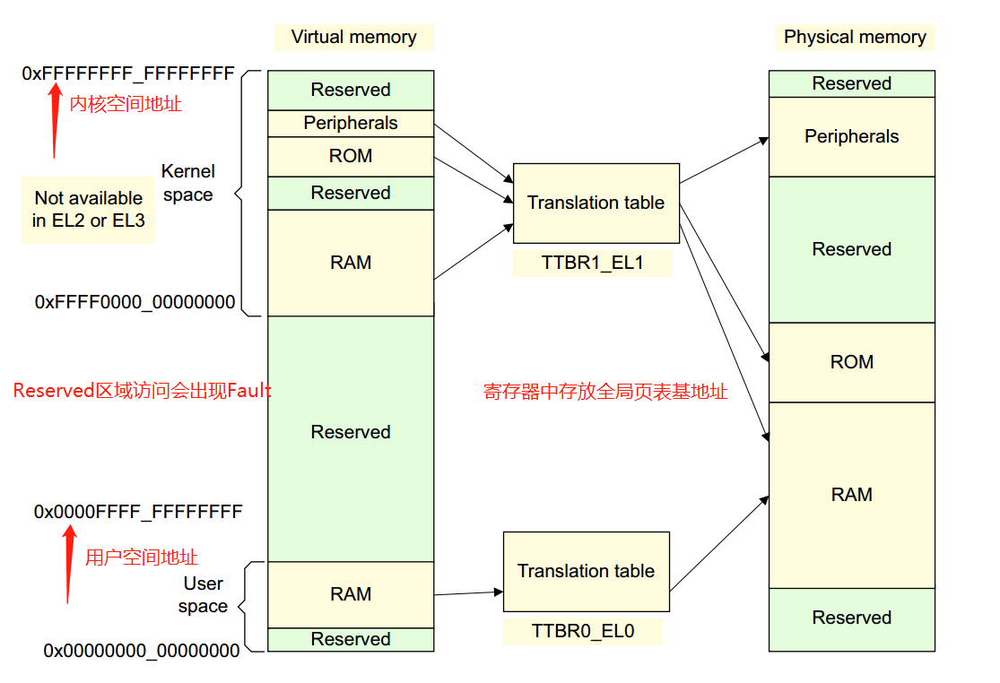
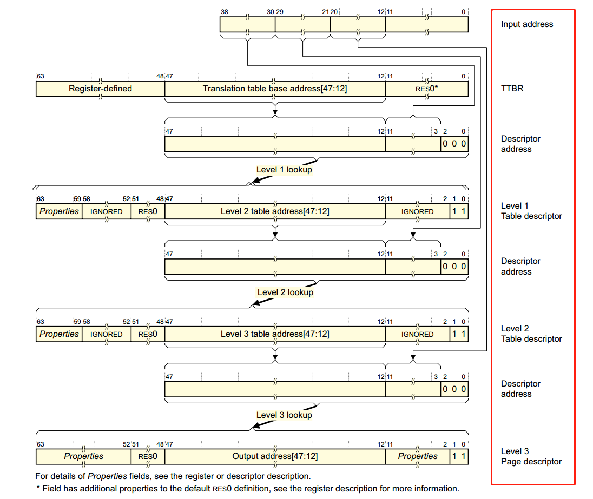
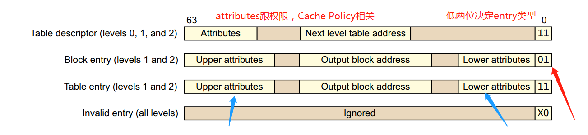
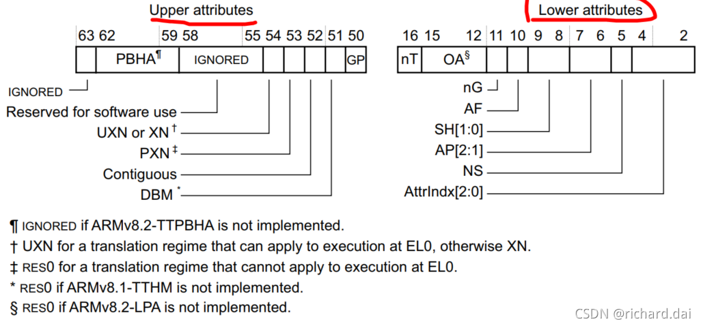

### 0. 前言

操作系统的核心任务是对系统资源的管理，包括 CPU和内存。为了使进程摆脱物理内存的制约，用户进程运行
在虚拟内存之上，每个用户进程都拥有完整的虚拟地址空间，互不干涉。实现虚拟内存的关键在于建立
虚拟地址（Virtual Address,VA）与物理地址（Physical Address,PA）之间的关系。

为了实现虚拟地址到物理地址的转换，借助硬件内存管理单元（MMU）通过页表（Page Table）进行
地址转换（Address Translation）。

### 1. 分页 Paging
#### 1.0 简述

分页，将内存划分为固定长度的单元。

* 对于虚拟地址空间，分页机制将虚拟内存分割成固定大小的单元，每个单元称为页（page）。
* 对于物理地址空间，分页机制将物理内存分割成固定大小的单元，每个单元称为页帧（frame）。

通过分页机制管理内存的核心是虚拟地址转换成物理地址，如下。

由于页表记录 VPN 到 PFN 的映射关系，于是通过 VPN 索引到 PFN，并且 VA offset 等于 PA offset，
PFN + VA offset 等于物理地址，即 MMU 通过页表找到了物理地址。

#### 1.1 页表存储位置

页表存储在物理内存中

#### 1.2 进程地址空间如何切换？

每个进程都拥有自己独立的虚拟地址空间，每个进程都拥有自己的一套页表，于是切换进程地址空间相当于
控制 MMU 访问不同的页表。

所以进程地址空间切换时，只需要设置页表基址寄存器，指向不同的页表即可。

页表基址寄存器，X86 是 CR3（Control Register 3）寄存器，ARM64 是 TTBR
（Tranlation Table Base Register）寄存器。

#### 1.3 实际使用的分页机制

考虑到分页机制的页表会占用过多内存，实际的分页机制采用多级分页，常用四级分页（PGD/PUD/PMD/PT）。

使用多级分页存在如下问题：

1. 多级页表的后几级页表本身没有映射物理内存，MMU 进行地址转换时，发现页表本身不存在物理内存，
   需要触发缺页异常，申请物理内存到页表本身。
2. MMU 通过页表基址寄存器找到页表，页表存储在物理内存中，访问页表时相当于访问物理内存，
   需要一级一级访问物理内存。

如何解决这一问题呢？

让 MMU 查找页表时，不访问物理内存即可，即通过 TLB（Translation Lookside Buffer）解决。
因为 TLB 是 cache，缓存页表项在 cache 中。

### 2. X86 Paging

CR3 寄存器保存页表基地址，MMU 使用虚拟地址 VA 通过页表逐级查找到物理地址 PA，如下：

各级页表项的标志，如下：

* P  : 1 表示此页在内存中，0 表示此页不在内存中
* R/W: 1 表示此页读写权限，0 表示此页只读权限
* U/S: 特权等级，0 表示 User 模式无法访问此页
* PWT: 1 表示 cache 使用 write through 策略，0 表示 cache 使用 write back 策略
* PCD: 1 表示 disable cache，0 表示 enable cache
* A  : 当访问此页时，硬件自动置 1，软件手动置 0
* D  : 当对此页进行写操作时，硬件自动置 1，软件手动置 0

### 3. ARM Paging

* TCR 寄存器控制页表映射的参数，其中 `TCR.TG0/TG1` 决定页大小（4KB/16KB/64LB/2MB）。
* 两个页表基址寄存器 TTBR0 和 TTBR1，分别用于用户态和内核态。
* ASID 用于标识进程，根据 ASID 划分 TLB entry，避免 TLB entry 频繁 Flush。

ARMv8中，`Kernel Space`的页表基地址存放在`TTBR1_EL1`寄存器中，`User Space` 页表基地址
存放在`TTBR0_EL0`寄存器中，
其中内核地址空间的高位为全1，`(0xFFFF0000_00000000 ~ 0xFFFFFFFF_FFFFFFFF)`，
用户地址空间的高位为全0，`(0x00000000_00000000 ~ 0x0000FFFF_FFFFFFFF)`。

MMU 根据虚拟地址`VA[63]` 选择 TTBR1 还是 TTBR0，如果 63bit 等于 1 选择 TTBR1，
等于 0 选择TTBR0。

图中 `attributes`用于控制 memory 权限，memory ordering，cache policy 等。

各级页表项的标志，如下：

* AttrIndx   : 指定内存属性，包含 cache 属性等
                        - 0：DEVICE_nGnRnE
                        - 1：DEVICE_nGnRE
                        - 2：DEVICE_GRE
                        - 3：NORMAL_NC
                        - 4：NORMAL
                        - 5：NORMAL_WT
* AP1        : 表示内存访问权限。
                        - 1 表示可以被 EL0 以及更高等级访问，
                        - 0 表示不能被EL0访问，但是可以被 EL1 访问。
* AP2        : 读写权限
                        - 1：表示只读
                        - 0：表示可读可写
* SH         : 内存缓存共享属性。
                        - 00：没有共享
                        - 01：保留
                        - 10：Outer Shareable
                        - 11：Inner Shareable
* nG         : 1 代表此页对应的 TLB entry 是进程私有的。
               0 代表此页对应的 TLB entry 是全局的。
* AF         : 当访问此页时，硬件自动置 1，软件手动置 0
* DBM        : 当对此页进行写操作时，硬件自动置 1，软件手动置 0
* Contiguous : 1 表示此页处在一个连续物理内存中，可以使用单一TLB entry 进行优化。
* PXN        : 1 表示此页在特权模式下不能执行。
* XN/UXN     : XN 表示此页在任何模式下都不能执行。UXN 表示此页在用户模式下不能执行。

### 4. RISC-V Paging

#TODO
