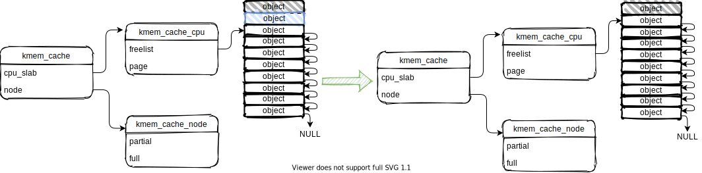

## 0. 简介

linux kernel的小内存（4K大小以下）分配使用slab分配器, 不过由于历史原因，此处的slab分配器是对小内存分配器的统称。

slab分配器有slab, slub, slob算法，从某一个linux kernel版本后，默认使用slub算法。

本文研究linux2.6.34版本的内存管理子系统，基于slub算法的slab分配器（也叫 slub分配器），slub分配器从buddy分配器分配得到的内存叫作**slab**，一个slab可能有1 page，也可能有2 page等等，然后将一个slab分成若干等分大小相同的小内存，这些小内存叫作**object**

## 1. 原理

### 1.1 申请object

申请object时，可以分成4种情况。具体slub分配器通过检查如下变量是否为NULL，执行不同的情况下的object分配

* `kmem_cache_cpu`结构体的`freelist`变量（指向slab的第一个空闲object）
* `kmem_cache_cpu`结构体的`page`变量（如果slab存在，一直指向slab的第一个object）
* `kmem_cache_node`结构体的`partial`链表（指向有部分空闲object的slab）

**第一情况**：当slub系统刚刚创建完成时，此时没有分配任何slab，第一次进行申请object

通过检查`freelist`变量、`page `变量 和 `partial`链表都等于 `NULL` ，可知是此情况

所以从buddy分配器申请新slab，然后将`page `变量指向新slab的第一个object，并且将第一个空闲的object返回，最后`freelist`变量指向下一个空闲的object

**第二种情况**：`kmem_cache_cpu`结构体的`page`变量指向的slab有空闲object

通过检查`freelist`变量不等于NULL，可知是此情况

所以将`freelist`变量指向的第一个空闲的object返回，然后将`freelist`变量指向下一个空闲的object

**第三种情况**：`kmem_cache_cpu`结构体的`page`变量指向的slab没有空闲object，但是`kmem_cache_node`结构体的`partial`链表指向的slab有空闲object

通过检查`freelist`变量等于NULL，同时`page `变量 和 `partial`链表不等于NULL，可知是此情况

所以先将`page`变量指向的slab移动到`full`链表，然后再把`partial`链表指向的slab的第一个空闲object返回，同时将`freelist`变量指向下一个空闲的object

**第四种情况**：`kmem_cache_cpu`结构体的`page`变量指向的slab没有空闲object，`kmem_cache_node`结构体的`partial`链表指向的slab也没有空闲object，只能向buddy分配器申请新slab

通过检查`freelist`变量等于NULL，但是`page `变量不等于NULL 和 `partial`链表等于NULL，可知是此情况

所以先将`page`变量指向的slab移动到`full`链表，然后从buddy分配器申请新slab，并且将第一个空闲的object返回，同时将`freelist`变量指向下一个空闲的object

### 1.2 释放object

释放object时，可以分成4种情况，如下：

**第一种情况**：释放的object属于`kmem_cache_cpu`结核体的`freelist`变量指向的slab

**第二种情况**：释放的object属于`kmem_cache_node`结构体的`full` 链表指向的slab

**第三种情况**：释放的object属于`kmem_cache_node`结构体的`partial` 链表指向的slab，但是释放后，`partial`链表指向的slab不为空

**第四种情况**：释放的object属于`kmem_cache_node`结构体的`partial` 链表指向的slab，但是释放后，`partial`链表指向的slab为空

## 参考链接

[linux 内核 内存管理 slub算法 （一） 原理](https://blog.csdn.net/lukuen/article/details/6935068)