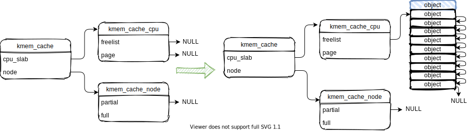
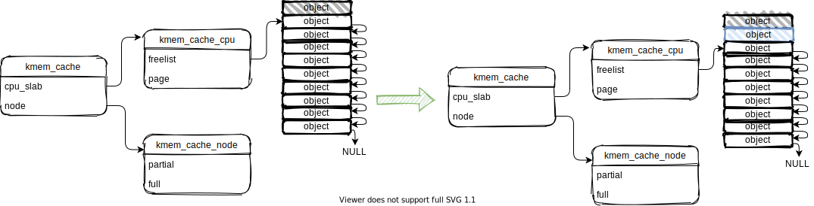
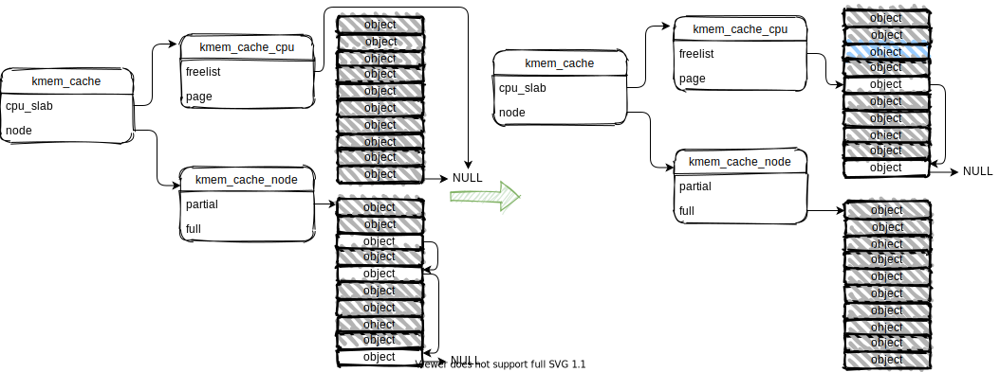

## 0. 简介

linux kernel的小内存（4K大小以下）分配使用slab分配器, 不过由于历史原因，此处的slab分配器是对小内存分配器的统称。

slab分配器有slab, slub, slob算法，从某一个linux kernel版本后，默认使用slub算法。

本文研究linux2.6.34版本的内存管理子系统，基于slub算法的slab分配器（也叫 slub分配器）

## 1. 原理

### 1.1 申请小内存

申请小内存时，可以分成4种情况，如下：

第一情况：当slub系统刚刚创建完成时，此时没有分配任何slab，第一次进行申请

第二种情况：kmem_cache_cpu中保存的slab有空闲object

第三种情况：kmem_cache_cpu中没有空闲的object，但是kmem_cache_node的partial中有空闲的object

第四种情况：kmem_cache_cpu中没有空闲的object，kmem_cache_node的partial也没有空闲的object，只能向buddy分配器申请新slab

### 1.2 释放小内存

释放小内存时，可以分成4种情况，如下：

第一种情况：释放小内存属于kmem_cache_cpu的slab

第二种情况：释放小内存属于kmem_cache_node full 链表中的slab

第三种情况：释放小内存属于kmem_cache_node partial 链表中的slab，但是释放后partial链表不为空

第四种情况：释放小内存属于kmem_cache_node partial 链表中的slab，但是释放后partial链表为空

## 参考链接

[linux 内核 内存管理 slub算法 （一） 原理](https://blog.csdn.net/lukuen/article/details/6935068)