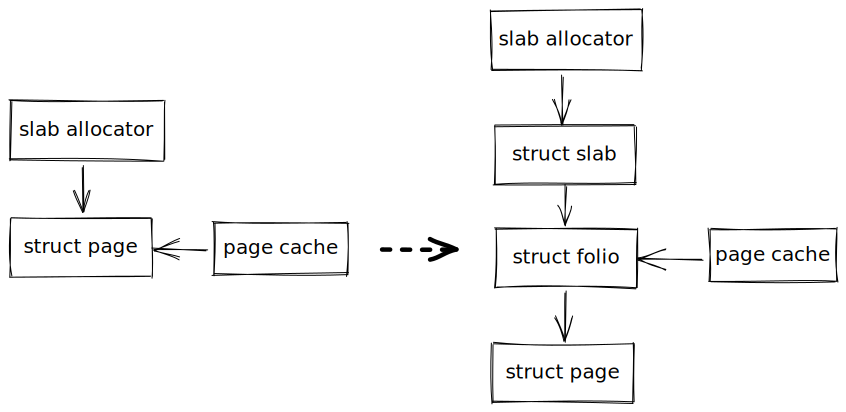

开局一张图，后面全靠...

`Linux Kernel` 中任何操作内存的步骤都是通过 `struct page` 进行，比如 `slab` 分配器 或 `page cahce`，通过 `page` 分配器申请物理内存时，都是返回物理内存对应的 `struct page`

`Linux Kernel` 中所有子系统都通过 `struct page` 进行操作物理内存，会导致什么问题？

1. `struct page` 可以代表一个页，也可以代表一个复合页，结构体定义不明确
2. 为了支持各种情况，`struct page` 越来越臃肿，容易出现越界踩踏事件

在 `v5.16-rc1` 合并窗口，`Matthew Wilcox` 向 `Linux Kernel` 提交了一个新 `feature`：`folio`, 它表示 0 阶页或复合页头页，结构体类型为 `struct folio`，这样就能够解决以上第一种问题。

`struct folio` 的出现，

首先让 `文件系统/page cache` 通过 `folio` 使用 `page` 更加清晰并且统一，因为 `folio` 只能是 0 阶页或复合页头页，不可能是尾页。同时还能允许 `文件系统/page cahe` 管理大于一页的内存块。

为什么不像 `THP` 一样直接使用复合页面？因为 `文件系统/page cache` 一些函数只期望一个头页，而另一些函数期望包含特定字节的页。

其次，能够删除内联函数 `VM_BUG_ON(PageTail(page))`、`compound_head()` 调用，这样在一定程度上减少了 `vmlinux` 的大小，提高编译速度以及程序执行效率。

最后，在 `v5.17-rc1` 合并窗口，`Vlastimil Babka` 基于 `folio` 从 `struct page` 将 `slab` 相关成员变量抽离为 `struct slab`，实际上 `struct page` 与 `struct slab` 指向相同的物理内存。这样做的好处，带来了更好的类型安全性，同时解决了以上第二种问题。
