# 计算机存储设备

既然要分析 Linux I/O，就不能不了解计算机的各类存储设备。

存储设备是计算机的核心部件之一，在完全理想的状态下，存储设备应该要同时具备以下三种特性：

1. 速度足够快：存储设备的存取速度应当快于 CPU 执行一条指令，这样 CPU 的效率才不会受限于存储设备。
2. 容量足够大：容量能够存储计算机所需的全部数据。
3. 价格足够便宜：价格低廉，所有类型的计算机都能配备。

但是现实往往是残酷的，我们目前的计算机技术无法同时满足上述的三个条件，于是现代计算机的存储设备设计采用了一种分层次的结构：

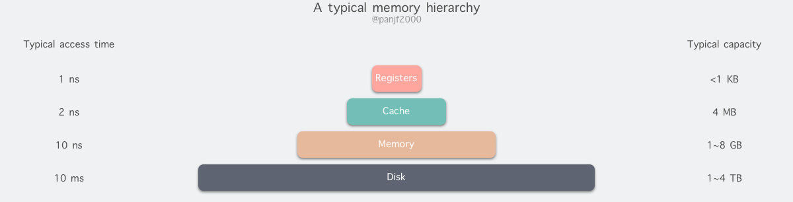

## 寄存器 Registers

TODO

## 高速缓存 Cache

TODO

## 物理内存 RAM

我们平时一直提及的内存就是 Memory，RAM 主存。

## 虚拟内存

虚拟内存主要是用来解决应用程序日益增长的内存使用需求，现代物理内存的容量增长已经非常快速了，然而还是跟不上应用程序对主存需求的增长速度，对于应用程序来说内存还是不够用，因此便需要一种方法来解决这两者之间的容量差矛盾。

计算机对内存访问经历了 `直接访问绝对内存地址` --> `静态重定位` --> `动态重定位` --> `交换(swapping)技术` --> `虚拟内存`。

虚拟地址分为两部分：虚拟页号和偏移量 `offset`。虚拟地址转换成物理地址是通过页表 `page table` 来实现的，每个用户进程都有自己的虚拟地址空间以及独立的页表，页表由页表项 `page table entry` 构成，页表项中保存了 `PFN`、`dirty`、`access`、`r/w` 和 `present` 位等信息。从数学角度来说，页表就是一个函数，入参是虚拟页号，输出是 PFN，最终物理地址等于 `PFN+offset`。

在 MMU 进行地址转换时，如果页表项的 `present` 位是 0，则表示该虚拟地址没有映射到物理内存，则会引发一个**缺页中断**。在进行内存回收时，如果页表项里的 dirty 已经被设置过，则这是一个脏页 (dirty page)，需要回写数据到磁盘中。

最后，因为虚拟内存的分页机制，页表一般是保存在内存中，导致进程通过 MMU 访问内存比直接访问内存多了一次内存访问，性能至少下降一半，因此需要引入加速机制，即 转换检测缓冲器 (Translation Lookaside Buffer，TLB) ，也叫快表，是用来加速虚拟地址访问，可以简单地理解成页表的高速缓存，保存了最高频被访问的页表项。MMU 收到虚拟地址时一般会先通过硬件 TLB 查询对应的页表号，若命中，则直接从 TLB 取出对应的 PFN 返回，若不命中，则到页表中查询。

## 磁盘 disk

TODO

# 用户态与内核态

用户进程在运行时，大部分时间处于用户态，当需要操作系统完成一些用户态没有权限的操作时，就需要切换到内核态。那么用户进程如何切换到内核态去使用这些资源呢？答案是：系统调用 (trap) ，异常 (exception) 和 中断 (interrupt) 。

- **系统调用**：用户进程主动发起的操作。用户态进程发起系统调用主动要求切换到内核态，陷入内核之后，由操作系统来操作系统资源，完成之后再返回到进程。
- **异常**：被动的操作，且用户进程无法预测其发生的时机。当用户进程在运行期间发生了异常，这时会切换到处理此异常的内核相关函数中，也即是切换到了内核态。异常包括缺页、缓冲区溢出、各种错误（如：除 0）等。
- **中断**：当外围设备完成用户请求的操作后，会向 CPU 发出相应的中断信号，这时 CPU 会暂停执行下一条即将要执行的指令，转到中断信号对应的处理程序去执行，如果前面执行的指令是用户态下的程序，那么转换的过程自然就会是从用户态到内核态的切换。中断包括 I/O 中断、外部信号中断、各种定时器引起的时钟中断等。

中断和异常类似，都是通过中断向量表来找到相应的处理程序进行处理。区别在于，中断来自处理器外部，不是由任何一条专门的指令造成，而异常是执行当前指令发生错误的结果。

# 物理内存分区

Linux 必须处理由于硬件缺陷而导致的内存寻址问题：

- 一些硬件只能使用特定的内存地址来执行 DMA (Direct Memory Access，直接内存访问)。
- 物理寻址范围要比虚拟寻址范围更加大，这就导致溢出的那部分物理内存无法永久性映射到内核空间上。

基于以上的限制，Linux 在管理整个物理内存时，将其划分成六个区：

- ZONE_DMA         ：执行有硬件缺陷的外围设备 DMA 操作的
- ZONE_DMA32
- ZONE_NORMAL  ：永久性直接映射
- ZONE_HIGHMEM：只能进行临时映射
- ZONE_MOVABLE ：与ZONE_NORMAL 类似，但是这些内存是可移动的
- ZONE_DEVICE     ：主要为某些特定的设备服务，比如 GPU

### 32 位的体系架构

用户空间访问虚拟地址范围为 0～3GB，内核空间访问虚拟地址范围为 3～4GB。

在 i386 架构上，ISA 设备被禁止在整个 32 位的地址空间中执行 DMA，因为 ISA 设备只能访问物理内存前 16MB 的地址。所以 ZONE_DMA 范围是 `0~16MB`。

在 i386 架构上，`ZONE_HIGHMEM` 范围是高于 896MB 的全部内存区域。下图是 2GB 物理内存的布局：

```c
  0                                                            2G
  +-------------------------------------------------------------+
  |                            node 0                           |
  +-------------------------------------------------------------+
  0         16M                    896M                        2G
  +----------+-----------------------+--------------------------+
  | ZONE_DMA |      ZONE_NORMAL      |       ZONE_HIGHMEM       |
  +----------+-----------------------+--------------------------+
```

`ZONE_HIGHMEM` 就是所谓的高端内存 (high memory)，剩下区域就是低端内存 (low memory)。需要注意的是，高端内存是内核空间的概念，用户空间没有这个说法。

### 64 位的体系架构

内存的任何地址都可以执行 DMA，此时 `ZONE_DMA` 是空的。

无论用户空间还是内核空间，虚拟地址空间都很大，能够完全覆盖所有物理内存，所以不存在  `ZONE_HIGHMEM`。

`ZONE_NORMAL` 负责内核中所有的内存分配。

# Linux I/O Stack

## Diagram for Linux Kernel 6.9

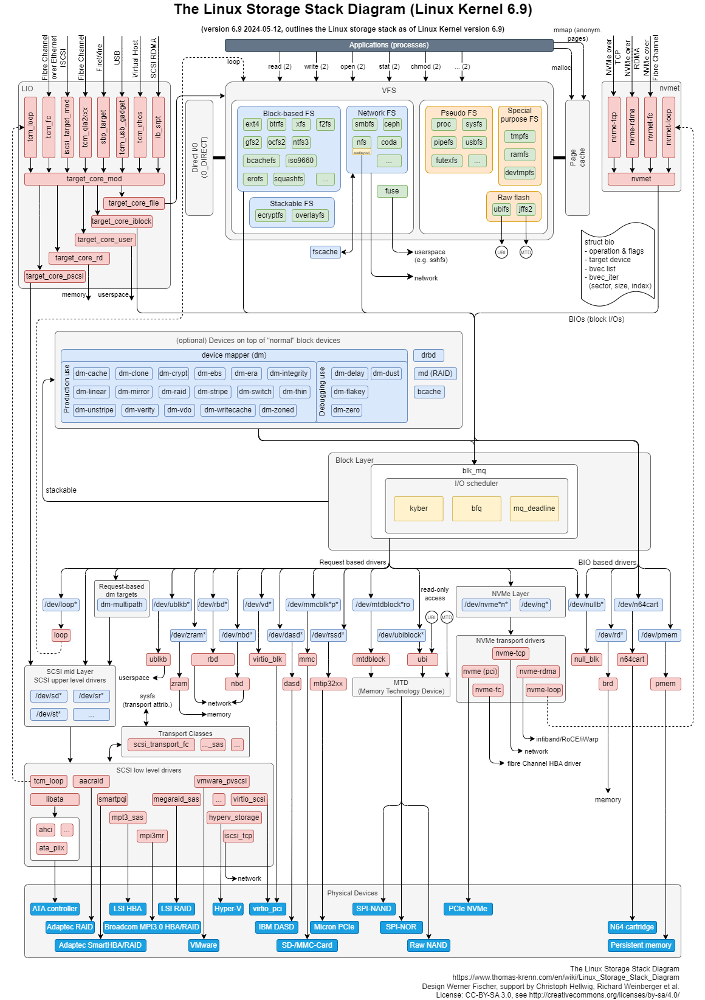

## 理论分析
### 虚拟文件系统（VFS）

虚拟文件系统是一个内核子系统，其主要的作用是为用户空间的程序提供文件和文件系统相关的接口。系统中的所有文件不但依赖于 VFS 共存，而且也需要依靠 VFS 来协同工作。通过 VFS，用户空间的程序可以利用标准的 Unix 系统调用对不同的文件系统，甚至是不同存储介质上的文件系统进行 I/O 操作。

VFS 之所以能支持各种不同的文件系统，是因为它定义了一系列标准的接口和数据结构，任何想接入 VFS 的实际文件系统都需要实现这些接口和数据结构，然后将所有来自用户态的 I/O 操作都重定向到当前 VFS 接入的实际文件系统的对应实现，借助 VFS 的各种数据结构，最后与块设备 (Block Device) 进行交互从而读写数据。

Unix 使用了四种和文件系统相关的传统抽象概念：文件 (file)、目录项 (dentry)、索引节点 (inode) 和挂载点 (mount point)。在 Unix 中，文件系统被挂载在全局分层结构中一个特定的 mount point 上，这个 mount point 被称为命名空间 (namespace)，所有已挂载的文件系统都作为根文件系统树的树枝 (入口) 而存在。

VFS 支持的文件系统大致可以归纳为以下几种：

- _**基于块设备的文件系统 (Block-based FS)**_：ext2/3/4, btrfs, xfs, ifs, iso9660, gfs, ocfs, etc.
    - 基于物理硬件存储设备的文件系统，通常用于以连续的块为存储单位的块设备，支持随机 I/O。
- _**网络文件系统 (Network FS)**_：NFS, coda, smbfs, ceph, etc.
    - 也叫_**分布式文件系统 (Distributed FS)**_，其中的文件(设备)分布在不同位置，通过网络进行通信，但是就像访问本地磁盘文件一样，一般会用 [ACL](https://en.wikipedia.org/wiki/Access-control_list) 鉴权。
- _**伪文件系统 (Pseudo FS)**_：proc, sysfs, pipefs, futexfs, usbfs, etc.
    - 这是一种基于"虚拟文件"的文件系统，在这种文件系统中的"虚拟文件"的树状结构会和那些基于磁盘的文件系统中的文件一样，也可以通过系统调用或者其他能够操作磁盘文件的工具对这些"虚拟文件"进行操作，所以被称为伪文件系统。它们以文件系统的方式为使用者提供了访问操作系统和硬件的层次化接口。
- _**堆栈式文件系统 (Stackable FS)**_：ecryptfs, overlayfs, unionfs, wrapfs, etc.
    - 这是一种本身并不存储数据，而叠加在其他文件系统之上的一种文件系统，这一类文件系统通常会利用下层的文件系统来实现数据存储。
- _**文件系统接口 (File system interfaces)**_：FUSE, LUFS, PUFFS, etc.
    - 严格来说这不是真正的文件系统，而是一种接口，它提供了一种可以不用修改内核的方式实现文件系统：通过在用户空间运行文件系统的代码。用户空间文件系统相比内核文件系统更加灵活，但性能通常更低。
- _**特殊用途文件系统 (Special Purpose FS)**_：tmpfs, ramfs, devtmpfs, etc.
    - 上述的 pseudo FS、stackable FS 和 file system interfaces 其实都归属在这一类文件系统中。或者说基本上所有的不是基于磁盘和网络的文件系统都属于特殊用途文件系统。这种文件系统的主要用于计算机进程之间的通信或者用作临时文件空间。所以这一类的文件系统通常使用内存而不是磁盘作为它的后端存储设备，但是操作起来就像是在操作磁盘。

VFS 中的主要的对象和数据结构定义：

- superblock: 超级块对象，代表一个已挂载的具体文件系统，存储文件系统的元信息。
- inode: 索引节点对象，代表一个文件，存储文件的元信息。
- dentry: 目录项对象，代表一个目录项，是文件路径的其中一个组成部分。
- file: 文件对象，代表由进程打开的一个文件。

需要注意的是，因为在 Unix 的万物皆文件的设计理念，所以 VFS 中并没有目录的概念，而是将目录也作为一个文件来处理，所以只有文件对象，而没有目录对象。目录项对象代表的是文件路径中的一个组成部分，它可能包含一个普通文件，所以目录项不是目录，目录只是一种特殊的文件。

VFS 的每一个主要对象都会包含一个操作对象，这些操作对象描述了内核针对 VFS 的主要对象可以使用的方法：

- super_operations 对象，其中包含内核针对特定文件系统所能调用的方法，比如 `write_inode()` 和 `sync_fs()` 等。
- inode_operations 对象，其中包含内核针对特定文件所能调用的方法，比如 `create()` 和 `link()` 等。
- dentry_operations 对象，其中包含内核针对特定目录项所能调用的方法，比如 `d_compare()` 和 `d_delete()` 等。
- file_operations 对象，其中包含进程针对已打开文件所能调用的方法，比如 `read()` 和 `write()` 等。

#### 超级块 (SUPERBLOCK)

超级块代表一个文件系统实例，也就是一个挂载的文件系统

```c
struct super_block {
	struct list_head                s_list;      // 指向所有其他相同文件系统类型的超级块的链表。
	dev_t                           s_dev;       // 设备标识符
	unsigned long                   s_blocksize; // 块大小，以 byte 为单位
	loff_t                          s_maxbytes;  // 块大小，以 bit 为单位
	struct file_system_type         *s_type;     // 文件系统类型，包括名字、属性和其他信息
	const struct super_operations   *s_op;       // 内核可以调用的超级块方法,这些回调函数就是每一个具体的文件系统的提供给 VFS 的功能。
	uuid_t                          s_uuid;      // 这个文件系统的唯一标识 UUID
	struct list_head                s_inodes;    // 这个文件系统中的所有 inodes 列表
	unsigned long                   s_magic;     // 文件系统的魔数
	struct dentry                   *s_root;     // 目录挂载点
	int                             s_count;     // 超级块的引用计数
	void                            *s_fs_info;  // 文件系统的一些特殊信息
	const struct dentry_operations  *s_d_op;     // 目录项的默认操作对象
	...
};

struct super_operations {
	struct inode *(*alloc_inode)(struct super_block *sb);
	void (*destroy_inode)(struct inode *);
	void (*free_inode)(struct inode *);

	void (*dirty_inode) (struct inode *, int flags);
	int (*write_inode) (struct inode *, struct writeback_control *wbc);
	int (*drop_inode) (struct inode *);
	void (*evict_inode) (struct inode *);
	void (*put_super) (struct super_block *);
	int (*sync_fs)(struct super_block *sb, int wait);
	int (*freeze_super) (struct super_block *, enum freeze_holder who);
	int (*freeze_fs) (struct super_block *);
	int (*thaw_super) (struct super_block *, enum freeze_holder who);
	int (*unfreeze_fs) (struct super_block *);
	int (*statfs) (struct dentry *, struct kstatfs *);
	int (*remount_fs) (struct super_block *, int *, char *);
	void (*umount_begin) (struct super_block *);

	...
};
```

超级块通常存储在存储设备本身，并在挂载时加载到内存中。超级块对象通过 `alloc_super()` 函数创建并初始化。文件系统会在挂载的时候调用这个函数从磁盘读取其对应的超级块并加载进内存中的超级块对象中。

每当文件系统需要对其超级块进行操作时，首先要在超级块对象中查询对应的操作函数。比如，如果文件系统要写自己的超级块，则调用 `sb->s_op->write_super(sb)`，这个函数是用来将内存中的最新的超级块更新到磁盘中持久化，VFS 通过这个函数对内存和磁盘中的超级块进行同步。

还有一点，关于 `write_super()` 这个函数，已经在内核 3.6 中被移除了 (但是原理是一样，所以不影响我们分析这些函数回调的原理)。从 v3.6 之后所有文件系统都需要自己管理超级块的更新同步。

关于 `super_operations` 中每一个函数功能的详细介绍请参考官方文档[8](https://strikefreedom.top/archives/linux-io-stack-and-zero-copy#user-content-fn-8)

#### 索引节点对象 (INODE)

inode, 是 index node 的缩写，也就是索引节点。索引节点表示文件系统中的一个对象，每个对象都有一个唯一的 id。inode 对象包含了内核在操作文件或目录时需要的全部的信息，文件 inode 包含指向文件内容的数据块的指针，目录 inode 包含指向存储名称。inode 的操作允许修改其属性和读取/写入其数据。

文件系统中的对象类型通常有以下几种：

- socket
- symbolic link
- regular file
- block device
- directory
- character device
- FIFO

所有文件系统中管理的任何对象类型都存在一个对应的 inode 实例

```c
struct inode {
	umode_t                         i_mode;     // 访问权限，比如可读或者可写
	kuid_t                          i_uid;      // 所有者的用户 ID
	kgid_t                          i_gid;      // 所有者所在的组 ID
	unsigned int                    i_flags;    // 文件系统标识
	const struct inode_operations   *i_op;      // inode 操作函数,这些回调函数就是每一个具体的文件系统的提供给 VFS 的功能。
	struct super_block              *i_sb;      // 所在的超级块
	struct address_space            *i_mapping; // 相关的地址映射
	unsigned long                   i_ino;      // 唯一标识这个 inode 的号码
	const unsigned int              i_nlink;    // 硬链接数
	dev_t                           i_rdev;     // 设备标识符
	loff_t                          i_size;     // 文件大小，以 byte 为单位
	struct timespec64               i_atime;    // 最后访问时间
	struct timespec64               i_mtime;    // 最后修改时间
	struct timespec64               i_ctime;    // 创建时间
	unsigned short                  i_bytes;    // 已使用的字节数
	const struct file_operations    *i_fop;     // 文件数据的函数操作，open、write、read 等,这些回调函数就是每一个具体的文件系统的提供给 VFS 的功能。
	struct address_space            i_data;     // 设备的地址映射

	...
};

struct inode_operations {
	struct dentry * (*lookup) (struct inode *,struct dentry *, unsigned int);
	const char * (*get_link) (struct dentry *, struct inode *, struct delayed_call *);
	int (*permission) (struct mnt_idmap *, struct inode *, int);
	struct posix_acl * (*get_inode_acl)(struct inode *, int, bool);

	int (*readlink) (struct dentry *, char __user *,int);

	int (*create) (struct mnt_idmap *, struct inode *,struct dentry *,
		       umode_t, bool);
	int (*link) (struct dentry *,struct inode *,struct dentry *);
	int (*unlink) (struct inode *,struct dentry *);
	int (*symlink) (struct mnt_idmap *, struct inode *,struct dentry *,
			const char *);
	int (*mkdir) (struct mnt_idmap *, struct inode *,struct dentry *,
		      umode_t);
	int (*rmdir) (struct inode *,struct dentry *);
	int (*mknod) (struct mnt_idmap *, struct inode *,struct dentry *,
		      umode_t,dev_t);
	int (*rename) (struct mnt_idmap *, struct inode *, struct dentry *,
			struct inode *, struct dentry *, unsigned int);
	int (*setattr) (struct mnt_idmap *, struct dentry *, struct iattr *);
	int (*getattr) (struct mnt_idmap *, const struct path *,
			struct kstat *, u32, unsigned int);

	...
} ____cacheline_aligned;
```

`inode_operations` 结构体定义了一组在 inode 上操作的回调函数: (简而言之，为打开文件的每个实例创建一个 struct 文件)

- 修改文件权限
- 创建文件
- 新建文件链接
- 新建目录
- 重命名文件

而 `file_operations` 则定义了一组针对 `file` 结构体的回调函数指针，文件系统中每一个打开文件都必须创建一个相应的 `file` 结构体。

关于 `inode_operations` 中每一个函数功能的详细介绍请参考官方文档[9](https://strikefreedom.top/archives/linux-io-stack-and-zero-copy#user-content-fn-9)

#### 目录项对象和目录项缓存 (DENTRY & DCACHE)

dentry 是 directory entry 的缩写，也就是目录项，它通过将 inode 索引节点编号与文件名关联，将 inode 和文件关联起来。inode 结构体作为文件系统中任何对象的代表，其内部虽然有一个字段作为该结构体的唯一 ID `i_ino`，但是这个字段是一个整型数，可读性较差，所以内核选择使用文件名(路径)作为用户层定位文件对象的标识。

正如前文所述，VFS 以路径名作为用户层的文件索引而实现了各式的 I/O 系统调用，比如常用的 `open()`、`read()`、`write()` 等系统调用，你可以发现都是基于文件路径进行操作的。还有一点，前面我们说过 inode 是唯一代表一个文件系统对象的存在，但其实文件对象也可能有不止一个唯一的标识，比如可以通过软链接和硬链接指向同一个文件对象，因此需要引入一个新概念 —— 文件(路径)名，用来将多个文件系统对象映射到同一个 inode，所以引入 dentry 从而把文件名和 inode 解绑也就变得顺理成章了。

VFS 把目录当做文件对待，所以在路径 /bin/vi 中，bin 和 vi 都属于文件 —— bin 是特殊的目录文件而 vi 是普通文件，路径中的每个组成部分都由一个 inode 表示，但似乎 VFS 经常需要执行目录相关的操作，比如路径名查找等。路径名查找需要解析路径中的每一个组成部分，不但要确保它有效，而且还需要再进一步寻找路径中的下一个部分。为了方便对文件路径进行查找操作，VFS 就引入了目录项的概念。每个 dentry 代表文件路径中的一个特定部分。对前面的那个例子来说，/、bin 和 vi 都是 dentry 对象。前两个是目录，最后一个是普通文件，也就是说在文件路径中，包括普通文件在内的每一个组成部分都是一个 dentry 对象。目录项也可包括挂载点。比如路径 /mnt/cdrom/foo 中，组成部分 /、mnt、cdrom 和 foo 都属于目录项对象。

dentry 结构定义

```c
struct dentry {
	/* RCU lookup touched fields */
	unsigned int d_flags;		/* protected by d_lock */
	seqcount_spinlock_t d_seq;	/* per dentry seqlock */
	struct hlist_bl_node d_hash;	/* lookup hash list */
	struct dentry *d_parent;	/* parent directory */
	struct qstr d_name;         // 文件的名称
	struct inode *d_inode;		/* Where the name belongs to - NULL is
					 * negative */ // 其关联的 inode
	unsigned char d_iname[DNAME_INLINE_LEN];	/* small names */

	/* Ref lookup also touches following */
	struct lockref d_lockref;	/* per-dentry lock and refcount */
	const struct dentry_operations *d_op;
	struct super_block *d_sb;	/* The root of the dentry tree */
	unsigned long d_time;		/* used by d_revalidate */
	void *d_fsdata;			/* fs-specific data */

	union {
		struct list_head d_lru;		/* LRU list */
		wait_queue_head_t *d_wait;	/* in-lookup ones only */
	};
	struct hlist_node d_sib;	/* child of parent list */
	struct hlist_head d_children;	/* our children */
	/*
	 * d_alias and d_rcu can share memory
	 */
	union {
		struct hlist_node d_alias;	/* inode alias list */
		struct hlist_bl_node d_in_lookup_hash;	/* only for in-lookup ones */
	 	struct rcu_head d_rcu;
	} d_u;
};

struct dentry_operations {
	int (*d_revalidate)(struct dentry *, unsigned int);
	int (*d_weak_revalidate)(struct dentry *, unsigned int);
	int (*d_hash)(const struct dentry *, struct qstr *);
	int (*d_compare)(const struct dentry *,
			unsigned int, const char *, const struct qstr *);
	int (*d_delete)(const struct dentry *);
	int (*d_init)(struct dentry *);
	void (*d_release)(struct dentry *);
	void (*d_prune)(struct dentry *);
	void (*d_iput)(struct dentry *, struct inode *);
	char *(*d_dname)(struct dentry *, char *, int);
	struct vfsmount *(*d_automount)(struct path *);
	int (*d_manage)(const struct path *, bool);
	struct dentry *(*d_real)(struct dentry *, enum d_real_type type);
} ____cacheline_aligned;
```

因为 dentry 不同于 super_block 和 inode，它在磁盘上没有对应的数据结构，所以使用文件路径名作为索引文件对象的时候，VFS 需要遍历整个文件路径中的所有部分并从块设备 (比如磁盘) 读取相关的数据实时解析成 dentry 对象，同时还要对路径中的每一部分进行验证和字符串比较。可想而知，这个过程是非常耗时和低效的，因此为了缓解这个过程的性能损耗，VFS 引入了目录项缓存，也就是 dcache。VFS 通过将文件路径中的每一个部分解析成的 dentry 对象缓存在内存中，下一次如果需要查找某一个路径，VFS 就会先到缓存中去找，如果命中了缓存则可以直接使用缓存，否则的话就必须要重新遍历路径并解析，再将解析完成的 dentry 对象放入 dcache 中，以便下次使用。

为了说明 dcache 的工作原理，我们先来介绍一下目录项对象由三种有效状态：被使用、未被使用和负状态。"被使用的" dentry 对应一个有效的 inode (`d_inode` 是有效值)，说明该 dentry 存在至少一个使用者。这种 dentry 指向了 VFS 中的一个有效的数据，因此不能从 dcache 中清理掉。"未被使用的" dentry 对应一个有效的 inode 但当前并没有被任何人使用，这一类的 dentry 对象也会被保留在 dcache 中，虽然现在没有使用，但是未来可能会用到，但是如果因为内存紧张需要淘汰一些缓存的话会优先考虑清理掉这部分对象。最后是"负状态"的 dentry，这一类的对象没有对应的 inode (`d_inode` 为 NULL)，表明 inode 已经被删除了或者路径无效了，这一类的对象也会被暂时保留，因为某些操作可能需要确认某些路径是无效的，这时候缓存这一类的 dentry 就会很有价值。同样地，如果需要淘汰缓存的话这部分数据会被优先考虑清理掉。

dcache 主要由以下三个部分组成：

- "被使用的" dentry 链表。该链表通过 inode 中的 `i_dentry` 字段把相关的 dentries 链接在一起，这是因为一个 inode 可能有多个指向它的链接 (比如有多个硬链接指向它) ，也就会对应多个 dentries，因此就用一个链表把这些对象串在一起。
- "最近被使用的"双向链表。所有"未被使用的"和"负状态"的 dentries 都存放在这个链表中，该链表按照插入时间倒序排列，也就是说最新的数据总是从链表头部插入，所以越靠近链表尾部的对象越旧。当内核决定要回收内存的时候，会使用 LRU 算法优先对链表尾部进行清理，也就是最近最少使用的数据会被优先清理掉。
- Hash 表。通过 hash 函数可以快速地根据给定文件路径获取对应的 dentry 对象，如果不在缓存中则返回空值。

VFS 把所有的 dentry 对象都放在 dcache 最后的这个 hash 表中，底层是 dentry_hashtable 数组 + 双向链表，每一个数组中的元素都是一个指向具有相同键值的 dentry 链表的指针，数组的大小取决于系统中物理内存的大小，通过 LRU 算法来管理内存。

关于 `dentry_operations` 中每一个函数功能的详细介绍请参考官方文档[10](https://strikefreedom.top/archives/linux-io-stack-and-zero-copy#user-content-fn-10)

#### 文件对象 (FILE)

VFS 的最后一个重要对象是 file 文件对象，它表示由用户空间进程打开的文件。这个对象将用户空间的文件和内核空间的 inode 对象关联起来，如果我们从用户空间的视角去看待 VFS，file 就是 VFS 提供的沟通用户空间和具体文件系统的标准接口，因为用户程序直接处理的就是文件而非超级块、索引节点和目录项。内核通常是通过分发一个文件描述符 (file descriptor) 给用户空间进程，用以对文件对象进行各种操作 (这是出于隔离性的考虑，内核不会把 file 的地址直接返回到用户空间，而是返回一个整型的 fd，这样更加安全），当执行文件系统调用时，内核将该 fd 映射到实际的文件结构。

文件对象是已打开的文件在内存中的表示。该内存对象通常由 `open()` 系统调用创建，由 `close()` 系统调用销毁，所有这些与文件对象相关的系统调用实际上都是文件操作函数表中定义的方法。从用户进程的视角看文件对象代表一个已打开的文件，但实际上从内核视角看，file 对象其实是指向了 dentry 对象，当然，实际上 dentry 对象又指向 inode，这才是真正的尽头，但是前面我们已经讲解过，因为很多原因需要用路径名和 dentry 来表示一个文件，所以从逻辑层面上讲 dentry 对象才真正表示一个已打开的文件

file 对象的定义

```c
struct file {
	struct path                     f_path;         // a dentry and a mount point which locate this file
	struct inode                    *f_inode;       // the inode underlying this file
	const struct file_operations    *f_op;          // callbacks to function which can operate on this file
	spinlock_t                      f_lock;
	atomic_long_t                   f_count;
	unsigned int                    f_flags;
	fmode_t                         f_mode;
	struct mutex                    f_pos_lock;
	loff_t                          f_pos           // offset in the file from which the next read or write shall commence
	struct fown_struct              f_owner;
	void                            *private_data
	struct address_space            *f_mapping;     // callbacks for memory mapping operations
	...
};

struct file_operations {
	struct module *owner;
	fop_flags_t fop_flags;
	loff_t (*llseek) (struct file *, loff_t, int);
	ssize_t (*read) (struct file *, char __user *, size_t, loff_t *);
	ssize_t (*write) (struct file *, const char __user *, size_t, loff_t *);
	ssize_t (*read_iter) (struct kiocb *, struct iov_iter *);
	ssize_t (*write_iter) (struct kiocb *, struct iov_iter *);
	int (*iopoll)(struct kiocb *kiocb, struct io_comp_batch *,
			unsigned int flags);
	int (*iterate_shared) (struct file *, struct dir_context *);
	__poll_t (*poll) (struct file *, struct poll_table_struct *);
	long (*unlocked_ioctl) (struct file *, unsigned int, unsigned long);
	long (*compat_ioctl) (struct file *, unsigned int, unsigned long);
	int (*mmap) (struct file *, struct vm_area_struct *);
	int (*open) (struct inode *, struct file *);
	int (*flush) (struct file *, fl_owner_t id);
	int (*release) (struct inode *, struct file *);
	int (*fsync) (struct file *, loff_t, loff_t, int datasync);
	int (*fasync) (int, struct file *, int);

	...

	ssize_t (*splice_write)(struct pipe_inode_info *, struct file *, loff_t *, size_t, unsigned int);
	ssize_t (*splice_read)(struct file *, loff_t *, struct pipe_inode_info *, size_t, unsigned int);

	...

	ssize_t (*copy_file_range)(struct file *, loff_t, struct file *,
			loff_t, size_t, unsigned int);
	loff_t (*remap_file_range)(struct file *file_in, loff_t pos_in,
				   struct file *file_out, loff_t pos_out,
				   loff_t len, unsigned int remap_flags);

	...
} __randomize_layout;
```

这里要强调的是，file 对象表示一个打开的文件，并且包含了诸如打开文件时使用的标志和进程可以读取或写入的偏移量等数据。当文件关闭时，这个数据结构将从内存中删除，诸如写数据之类的操作将被委托给相应的 inode。file 对象是由内核直接管理的。

每个进程都有当前打开的文件列表，放在 files 结构体中。

所有打开的 file 对象都存储在内核中的 `fd_array` 数组，用户空间持有的文件描述符 fd 本质上是这个数组的索引，fd 传递回内核进行相关的文件操作时，内核就是通过它从 `fd_array` 数组中取出真正的 file 对象进行相应的操作。

关于 `file_operations` 中每一个函数功能的详细介绍请参考官方文档[11](https://strikefreedom.top/archives/linux-io-stack-and-zero-copy#user-content-fn-11)

### 页缓存（page cache）

页高速缓存 (page cache) 是 Linux 内核实现的磁盘缓存机制。主要作用是减少对磁盘的访问。具体实现是通过把磁盘中的数据缓存到物理内存中，把对磁盘的访问改成对内存的访问。通常，缓存的数据源我们称之为后备存储，比如 Page Cache 的后备存储大多数时候是磁盘。之所以在大多数现代操作系统上都需要这个机制是基于以下两个因素：

1. 从本文的"计算机存储设备"那一个章节可以知道，不同层级的存储介质的访问速度往往也相差了好几个数量级，比如内存和磁盘，是 ns 和 ms 的差距，因此引入内存 cache 对于磁盘 I/O 的性能来说会带来数量级的提升，如果使用 CPU 的 L1 和 L2 的高速缓存则会更快。
2. 从概率上来讲，数据一旦被访问，就很可能在短期内需要再次访问，也就是热点数据。这种在短时间内多次访问同一片数据的原理被称作**时间局部原理 (Temporal Locality)**。这个原理描述了一种现象：如果数据在第一次被访问的时候就缓存起来，那么这个缓存就很可能会在极短的时间内被再次命中。由于内存访问要比磁盘访问快得多，同时又有 temporal locality 存在，所以内存缓存能给磁盘 I/O 带来质的飞跃。

#### Page cache 基本结构

在 Linux 还不支持虚拟内存技术之前，还没有页的概念，因此 `Buffer Cache` 是基于操作系统读写磁盘的最小单位 —— 块 (block) 来进行的，所有的磁盘块操作都是通过 `Buffer Cache` 来加速，Linux 引入虚拟内存的机制来管理内存后，页成为虚拟内存管理的最小单位，因此也引入了 `Page Cache` 来缓存 Linux 文件内容，主要用来作为文件系统上的文件数据的缓存，提升读写性能，常见的是针对文件的 `read()`/`write()` 操作，另外也包括了通过 `mmap()` 映射之后的块设备，也就是说，事实上 Page Cache 负责了大部分的块设备文件的缓存工作。而 `Buffer Cache` 用来在系统对块设备进行读写的时候，对块进行数据缓存的系统来使用，实际上负责所有对磁盘的 I/O 访问：

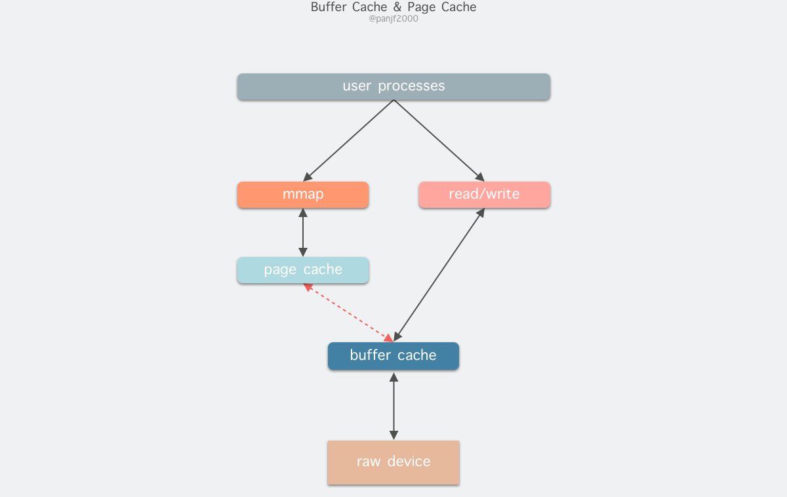


因为 `Buffer Cache` 是对粒度更细的设备块的缓存，而 `Page Cache` 是基于虚拟内存的页单元缓存，因此还是会基于 `Buffer Cache`，也就是说如果是缓存文件内容数据就会在内存里缓存两份相同的数据，这就会导致同一份文件保存了两份，冗余且低效。另外一个问题是，调用 `write` 后，有效数据是在 `Buffer Cache` 中，而非 `Page Cache` 中。这就导致 `mmap` 访问的文件数据可能存在不一致问题。为了规避这个问题，所有基于磁盘文件系统的 `write`，都需要调用 `update_vm_cache()` 函数，该操作会把调用 `write` 之后的 `Buffer Cache` 更新到 `Page Cache` 去。由于有这些设计上的弊端，因此在 Linux 2.4 版本之后，kernel 就将两者进行了统一，`Buffer Cache` 不再以独立的形式存在，而是以融合的方式存在于 `Page Cache` 中：

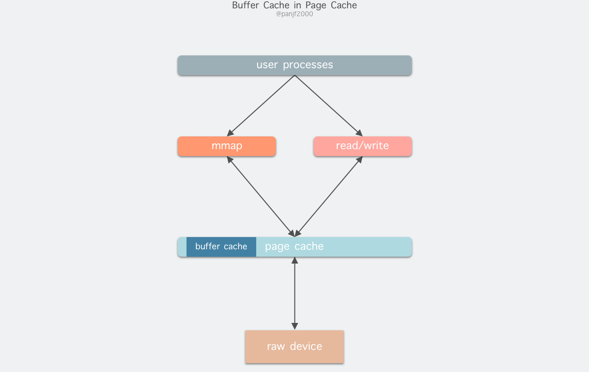

融合之后就可以统一操作 `Page Cache` 和 `Buffer Cache`：处理文件 I/O 缓存交给 `Page Cache`，而当底层 RAW device 刷新数据时以 `Buffer Cache` 的块单位来实际处理。

#### 写缓存

Page Cache 中通常有三种写策略：

1. `No Write`，也就是不缓存。当内核对 Page Cache 中的某一个数据块进行写操作的时候，直接越过缓存落到磁盘，同时把这一块缓存释放掉使其失效，后续请求读取这部分数据的时候，直接从磁盘读，然后再放入缓存。这种策略很少用，虽然实现简单，但是效率低下，因为磁盘 I/O 的频次比较多。
2. `Write Through`，也就是写穿缓存。内核的写操作对 Page Cache 进行更新之后，立刻穿透缓存将更新的数据落到磁盘。这种策略也被称为同步写策略，因为数据是同步更新到磁盘中，这种策略能很好地保持缓存一致性 —— 实时保持缓存和后备存储的同步。这种策略实现较为简单，但是性能较低，因为每个内存上的写操作都需要实时更新磁盘，而磁盘的速度比起内存要低了几个数量级，导致操作成本骤升。
3. `Write Back`，也就是写回缓存。内核更新完 Page Cache 之后就直接返回，不会同步更新磁盘，而是把那些被更新的内存页标记成 dirty pages，也就是脏页，并且将其加入到脏页链表中，等待一个或多个专门的内核线程周期性地把脏页链表中的内存页取出并写回到磁盘，从而使得内存和磁盘中的数据能够达到最终一致，最后清理掉脏页的 `PG_dirty` 标识。这种策略又被称为异步写策略，其性能最高，因为同步操作仅限于内存，写磁盘的耗时操作被异步化了，同时还能进行批量写的优化，代价是代码实现的复杂度高了很多。Linux 默认采取的是 Write Back 策略。

脏页落盘。从上面的写策略的介绍中我们可以得知，VFS 中的写操作实际上是异步的，也就是说写操作会被延迟执行。当 Page Cache 中的某些缓存页被更新之后，这些内存页会被标记为 `PG_dirty`，也就是"脏"数据。内核需要某种机制来确保内存中的 dirty pages 能被写回到磁盘，否则的话如果发生宕机事件，Page Cache 中那些已更新的"脏"数据就会永久性丢失，这个过程称为回写 writeback。通常有两种途径可以将脏页写入磁盘：

- 用户进程手动调用 `sync()`/`fsync()`/`fdatasync()` 等系统调用同步地将当前的脏页写入磁盘。
- 内核通过 flusher 线程定期自动将脏页写回到磁盘。
    - 当 Page Cache 中的 dirty pages 比例超过一个特定的阀值时，会挤占其他用户进程的可用内存，这时就需要让 Page Cache 释放掉一部分内存来救急，但是脏页所占的内存是不能直接就回收的，否则会造成缓存和磁盘的数据不一致，这时内核就会将当前的脏页写回磁盘，然后清理掉这些内存页的 `PG_dirty` 标志，使其变成"干净的"内存页，此时 Page Cache 就可以按照特定的策略 (比如 LRU 算法) 选出一部分页面来释放掉，收缩自身占用的内存。
    - 当脏页在内存中的驻留时间超过一个特定的阀值时，内核会将这些"超时的"脏页写回磁盘，以确保这些脏页不会因为停留在内存中太久而发生某种意外丢失。

我们先来讲解一下内核中专门负责脏页落盘的 flusher 线程，`sync()`/`fsync()`/`fdatasync()` 等系统调用放到后面讲，因为这些系统调用本质上也是唤醒 flusher 线程去工作。

一、WriteBack 多线程拥塞控制

Linux 最初的 bdflush 是单线程架构，可想而知这种设计会很容易使得线程在处理某一个磁盘的时候过于繁忙而导致其他磁盘上的 writeback 没有机会执行，也就是处于饥饿状态。在机械硬盘 HDD 占主流的时代，磁盘 I/O 的性能瓶颈主要在磁盘寻址操作上，因此内核在块设备之上设计了一个 I/O 调度层 (这部分会在后面的章节详细介绍) ，所有的 I/O 请求都会先放到一个单一的请求队列中，然后由调度程序统一对这些 I/O 请求进行合并与排序，将访问相邻磁盘扇区的多个请求合并成一个，同时将所有请求按照扇区地址顺序排列，这样就可以减少磁盘寻址操作，同时能让磁盘的磁头可以在金属盘片上连续地读写数据而不需要让机械臂来回转动进行随机读写，这种机制能极大地提升磁盘 I/O 性能。而单线程的 bdflush 很容易会阻塞在某个磁盘的 I/O 队列上，导致没有时间去其他磁盘执行 writeback。

2.6 内核引入了 pdflush 线程，通过多线程来解决这个问题，每个线程会尽量到每一块磁盘上去执行 writeback，这种设计在正常情况下可以运行得很好，但是因为这些线程是全局线程，所以极端情况下会出现多个线程阻塞在一个磁盘的 I/O 队列上，导致其他磁盘被饿死，这种情况就相当于又退化成单线程架构了，甚至还不如单线程模式，因为多线程还更占用系统资源。后来为了缓解这种极端场景，pdflush 现成设计了一种拥塞回避策略：每个线程需要主动识别出那些当前不拥塞的磁盘 I/O 队列，然后尽量往这些磁盘上去执行 writeback，这样就能让 pdflush 线程将其工作负载平摊开来，避免负载过于集中而导致饥饿问题。

pdflush 线程的拥塞控制策略从设计上是比较优秀的，但是有两个问题：

1. 实现上过于复杂，从前文的描述可知，每个线程都要主动检测 I/O 队列的繁忙情况，这又增加了内核与 I/O 系统通信成本，而且还需要平衡好每个磁盘的线程分布，不能过于集中也不能过于稀疏，算法复杂度较高。
2. I/O 总线技术和计算机其他部分的发展是不同步，通常前者的进步要缓慢很多，这就导致了计算机内各个部件之间的速度一直存在着代差，比如 CPU 因为摩尔定律的存在所以其处理速度进步很快，而磁盘的速度则一直都很缓慢，而且除了 pdflush 以外，I/O 系统中很少有其他组件应用了类似的拥塞控制策略，所以 pdflush 线程的拥塞控制就像是孤军奋战，虽然已经尽力在避免拥塞了，但是 I/O 栈中的拥塞还是时有发生，导致精心设计的拥塞控制算法性价比一直不高。

2.6.32 内核引入了新的方案：flusher 线程，并一直沿用至今。这个新方案使用了更简单的实现：将全局线程改为本地线程，每一块磁盘独占一个 flusher 线程，每个线程就只负责它所在的那块磁盘的 writeback 工作，也就是只从自己负责的那块磁盘上的脏页链表收集数据并回写到磁盘；这样也就不需要实现很复杂的拥塞控制算法了，通过这种相对简单的架构，实现了 I/O 请求的负载均衡，降低了饥饿风险，同时又能维持一个较高的 I/O 吞吐。这就是 HDD 磁盘的单一 I/O 队列下的 writeback 机制，至于 SSD 磁盘的多 I/O 队列下的 writeback 机制我们会在后面介绍。

二、手动 writeback

前文提到过，为了防止机器宕机导致 page cache 中的数据更新丢失，Linux 实现了 writeback 机制，保证了系统的可靠性。除了内核的自动 writeback 机制，用户进程也能通过系统调用来手动将脏页刷盘。为什么已经有了自动机制，还要提供手动的方式让用户进程去操作呢？因为自动的机制虽然方便，但是内核为了尽量减少对磁盘的写操作，其默认的刷盘策略通常不会太激进，也就是会平衡可靠性和成本，虽然我们可以通过修改内核参数来实现更激进的 writeback 策略，但是有时候用户程序希望数据能马上刷盘，那么最快的方式当然还是让用户进程自己手动写磁盘。因此，Linux 提供了以下几个系统调用：

_**sync & syncfs**_

```c
#include<unistd.h>

void sync(void);
int syncfs(int fd);
```

进行全局 writeback，将系统中的所有脏页都回写到磁盘。按照 POSIX 标准[16](https://strikefreedom.top/archives/linux-io-stack-and-zero-copy#user-content-fn-16)，`sync()` 的语义是较为宽松的，该标准只要求这个系统调用通知内核开始脏页刷盘之后就可以返回了，至于内核什么时候开始、什么时候完成，POSIX 对此没有要求。Linux 早期确实按照这个标准去实现的，用户进程调用该系统调用之后内核仅仅是唤醒 flusher 线程去工作就返回了，但是后来 Linux 加强了 `sync()` 的语义[17](https://strikefreedom.top/archives/linux-io-stack-and-zero-copy#user-content-fn-17)：系统调用阻塞直到存储设备向内核确认数据已经写入。从源码看，用户进程调用 `sync()`，内核会通过 `wakeup_flusher_threads()` 唤醒所有 flusher 线程并行进行 writeback，并且同步所有 inode 到磁盘，之后同步所有的块设备，而且等待所有工作完成后才返回。

`syncfs()` 的实现和 `sync()` 一样，但是它只针对给定文件所在的那一个文件系统进行同步 (而不是所有文件系统)。这个系统调用不属于 POSIX 标准，是 Linux 特有的。

_**fsync & fdatasync**_

```c
#include<unistd.h>

int fsync(int fd);
int fdatasync(int fd);
```

Linux 上的 `fsync()` 从一开始就严格按照 POSIX 标准的语义实现[18](https://strikefreedom.top/archives/linux-io-stack-and-zero-copy#user-content-fn-18)，也就是该系统调用必须等到内核真正把脏页写入磁盘之后才能返回。`fsync()` 不仅会将文件数据刷盘，而且还会把文件的元信息 metadata (inode) 也刷盘，这就表示一次 `fsync()` 调用会触发两次写操作。另外，`fsync()` 不保证文件所在目录的 dentry 也会一起同步到磁盘，因此通常还要针对目录的 fd 再调用一次。

`fdatasync()` 是为了解决上面提到的 `fsync()` 两次写操作的问题而引入的，它通常只会同步写文件数据到磁盘而异步写文件元数据，除非 metadata 的更新会影响到后续的文件数据读取，比如像是文件的大小 `st_size`，如果这个数据不更新到磁盘，其他用户进程读取文件的时候就可能造成数据错乱，所以如果这个元数据有更新，那么 `fdatasync()` 也会将其一起刷盘；而像 `st_atime` (文件最后访问时间) 和 `st_mtime` (文件最后修改时间) 这样并不会影响后续的文件读取的 metadata，`fdatasync()` 就不会同步写到磁盘，节省 I/O 开销。

这两个系统调用都是 POSIX 标准。需要注意的是，这两个系统调用的真实行为取决于具体的文件系统的实现，因为它们是通过 VFS 的 `file_operations.fsync` 函数指针实现的，所以在不同的文件系统中这两个系统调用的行为有可能不一致，比如有些文件系统会把 `fsync()` 实现成和 `fdatasync()` 一样，只同步文件数据而不同步元信息，在内核 2.2 以及之前的版本也是如此，甚至在一些更老的内核版本和文件系统中，文件系统不知道怎么进行脏页刷盘[19](https://strikefreedom.top/archives/linux-io-stack-and-zero-copy#user-content-fn-19)。

_**sync_file_range**_

```c
#define _GNU_SOURCE         /* See feature_test_macros(7) */
#define _FILE_OFFSET_BITS 64
#include <fcntl.h>

int sync_file_range(int fd, off_t offset, off_t nbytes, unsigned int flags);
```

`sync()` 的粒度是整个系统，`syncfs()` 的粒度是一个文件系统，`fsync()`/`fdatasync()` 的粒度是一个文件。对于 I/O 密集型的应用 (比如数据库) 来说，经常需要对大文件做多次小更新，而且需要频繁地刷盘而不想这里成为性能瓶颈，即便是用 `fdatasync()`，这个场景的 I/O 开销也非常大；而如果等所有更新完成之后再在一次性调用 `fsync()`/`fdatasync()` 的话会因为脏页数量过大而执行得特别慢。这时候就需要 `sync_file_range()` 出马了，这个系统调用在内核 2.6.17[20](https://strikefreedom.top/archives/linux-io-stack-and-zero-copy#user-content-fn-20) 引入，其核心的卖点就是细粒度刷盘+异步化，首先是细粒度，`sync_file_range()` 支持指定文件范围而不是整个文件去刷盘，其次是它可以异步操作，也就是不用阻塞等待它返回。

这个系统调用使用起来比较复杂，而且按照内核官方的文档，它使用起来有一定的风险，所以最好不要在编写跨平台可移植的程序时使用它[21](https://strikefreedom.top/archives/linux-io-stack-and-zero-copy#user-content-fn-21)，因为它完全不会同步文件的 metadata，所以只能依靠自动 writeback 机制去同步这些 metadata，因此如果发生宕机或重启，`sync_file_range()` 不保证那些调用过它同步数据的文件能恢复，因为磁盘上的文件元信息很可能是不全的，所以这个系统调用的不适合那些需要强持久化保证的数据库，比如 mysql，而只适合那些对持久化要求不高的数据库，比如 redis。总而言之，这个系统调用的适用范围比较窄，使用起来也比较复杂，而且风险较高，需要谨慎使用。这里就不过多介绍了，有兴趣的读者可以直接参考[官方文档](https://man7.org/linux/man-pages/man2/sync_file_range.2.html)，另外我推荐一篇写得很好的关于 `sync_file_range()` 的[文章](https://yoshinorimatsunobu.blogspot.com/2014/03/how-syncfilerange-really-works.html)，那里面除了介绍该系统调用的用法以外，还比较深度地剖析了它的工作原理，值得一读。

注意，这个系统调用不是 POSIX 标准，是 Linux 特有的。

_**O_SYNC & O_DSYNC & O_RSYNC**_

上面的那几个系统调用都是在需要的时候才对一个文件调用的，优点是比较灵活，只在有需求的时候才手动把脏页刷到磁盘，缺点是在一些场景中比较繁琐，比如某一个文件的所有写操作都需要马上刷回磁盘，那么每次写操作之后还得再调一个系统调用，不仅麻烦而且损耗性能。这个时候就可以通过 `open()` 系统调用打开文件的时候指定 `O_SYNC`、 `O_DSYNC` 和 `O_RSYNC` 标志[22](https://strikefreedom.top/archives/linux-io-stack-and-zero-copy#user-content-fn-22)，也可以通过 `fcntl()` 对已有的文件设置这两个标志。这三个文件标志是 POSIX 标准[23](https://strikefreedom.top/archives/linux-io-stack-and-zero-copy#user-content-fn-23)。

对一个文件指定这三个标志会开启同步 I/O (Synchronized I/O)[24](https://strikefreedom.top/archives/linux-io-stack-and-zero-copy#user-content-fn-24)：

- `O_SYNC`：每次读文件写操作都会阻塞直到数据被写入磁盘，相当于每次写操作之后都调用 `fsync()`。
- `O_DSYNC`：和 `O_SYNC` 一样，但是只会把文件数据写入磁盘，只有在某些特定的文件元信息会影响后续的读写操作的时候才会将其一起写入磁盘，相当于 `fdatasync()`。
- `O_RSYNC`：只影响读操作，需要和 `O_SYNC` 或 `O_DSYNC` 一起用。当设置了这个标志之后，调用 `read()` 的时候就会阻塞直到文件中的所有最近更新的数据都被写回磁盘之后才返回，也就是确保读操作取回的数据永远是最新的。实际上 Linux 并没有严格按照 POSIX 标准实现这个标志，而是在内核中简单地定义 `O_RSYNC` 为 `O_SYNC`。

#### 读缓存

Page Cache 本质上是内存中的物理页面组成的，其内容对应磁盘上的物理块 (Block)。Page Cache 的大小是动态调整的 —— 内存富余的时候会申请更多的内存以扩充自己，内存紧张的时候会释放自己占用的内存以缓解系统压力。当用户进程发起一个 `read()` 系统调用的时候，内核会先检查用户请求的数据是否已经在 Page Cache 中，如果是的话，则直接从缓存中读取出来返回给用户进程，这个过程被称之为缓存命中 —— cache hit；反过来如果数据不在缓存中，那么内核将不得不调度 I/O 操作从磁盘读取数据，然后把这些数据存入 Page Cache 以供下次使用，这个过程被称之为缓存未命中 —— cache miss。这里需要注意的是，内核并不一定会将整个磁盘文件都缓存起来，通常只会缓存其中的几个(内存)页，如果是很小的文件，则整个被缓存的概率会大一点。

预读策略。Page Cache 的缓存策略本质是基于计算机系统中数据访问的**时间局部性 (Temporal Locality)**：对同一内存位置的相邻的访问之间存在时间上的紧凑性，说人话就是说如果某个内存页在某一个时刻被访问，那么这个内存页在短时间内很可能会被再次访问。而 Page Cache 的预读策略本质则是基于计算机系统中数据访问的**空间局部性 (Spatial Locality)**：时间上相邻的内存访问之间存在空间上的紧凑性，说人话就是如果一个特定的内存页在某个特定的时刻被访问，那么这个内存页相邻的其他内存页在短时间内很可能也会被访问。Temporal Locality 实际上是 Spatial Locality 的一个特例。从前文所述中我们可以得知，I/O 栈里写操作是异步的，写完 Page Cache 就可以直接返回了；但是读操作却是同步的，如果 Page Cache 没有命中，则需要从磁盘读取，性能较差。因为处理磁盘文件的时候大多数时候都是顺序访问的，又根据 Spatial Locality 原理，访问了 [A, B] 地址范围内的数据之后很可能会继续访问 [B+1, B+N] 地址范围的数据，因此 Page Cache 就可以执行预读策略，在读取了当前内存页之后再异步地加载这一页后面内存页到 Page Cache，等到用户程序请求访问后面的内存页的时候，数据已经在 Page Cache 里了，可以直接返回给用户进程，大幅减少了磁盘 IO 的次数，避免阻塞 `read()` 等系统调用，延迟可以大大降低。内核中将这种预读机制称为 `readahead`。

以下是内核中的 VFS 读取文件的底层函数[25](https://strikefreedom.top/archives/linux-io-stack-and-zero-copy#user-content-fn-25)，可以看到内核会应用 readahead 预读机制加载磁盘数据到 Page Cache，如果请求读取的 Page 不在 Cache 中，那就需要同步地从磁盘加载上来，但是后续的相邻 Pages 就可以异步地加载，以便能尽快先把用户进程请求的数据返回到用户空间。在我们介绍完了 Linux I/O 栈的所有分层之后，进行整个 I/O 执行栈的具体分析的时候还会讲解这个函数，所以这里对这个函数有一个印象就行。

```c
/**
 * filemap_read - Read data from the page cache.
 * @iocb: The iocb to read.
 * @iter: Destination for the data.
 * @already_read: Number of bytes already read by the caller.
 *
 * Copies data from the page cache.  If the data is not currently present,
 * uses the readahead and read_folio address_space operations to fetch it.
 *
 * Return: Total number of bytes copied, including those already read by
 * the caller.  If an error happens before any bytes are copied, returns
 * a negative error number.
 */
ssize_t filemap_read(struct kiocb *iocb, struct iov_iter *iter,
		ssize_t already_read)
{
  ...
}
```

#### address_space 对象

Page Cache 中最核心的数据结构就是 address_space，它是一个嵌入在内存页对应的磁盘文件的 inode 中的数据结构。page cache 中的多个内存页可能是属于同一个磁盘文件的，也就是说这些页会被同一个 address_space 引用 (通过上面的 struct page 中的 `mapping` 和 `index` 字段指向 address_space)，因此 address_space 的主要作用是对内存页进行分组和管理，追踪内存页在磁盘文件中对应的位置，以及跟踪文件数据在进程虚拟地址空间中的映射地址。

通过 address_space 可以实现很多不一样但有关联的服务：缓解内存压力、按地址查找内存页，以及追踪脏页等。它的定义位于 [<include/linux/fs.h>](https://elixir.bootlin.com/linux/v6.10/source/include/linux/fs.h#L461)：

```c
struct address_space {
	struct inode		*host;
	struct xarray		i_pages;
	struct rw_semaphore	invalidate_lock;
	gfp_t			gfp_mask;
	atomic_t		i_mmap_writable;
#ifdef CONFIG_READ_ONLY_THP_FOR_FS
	/* number of thp, only for non-shmem files */
	atomic_t		nr_thps;
#endif
	struct rb_root_cached	i_mmap;
	unsigned long		nrpages;
	pgoff_t			writeback_index;
	const struct address_space_operations *a_ops;
	unsigned long		flags;
	errseq_t		wb_err;
	spinlock_t		i_private_lock;
	struct list_head	i_private_list;
	struct rw_semaphore	i_mmap_rwsem;
	void *			i_private_data;
} __attribute__((aligned(sizeof(long)))) __randomize_layout;
```

其中，`a_ops` 指向了 address_space 的操作函数表 `address_space_operations`，看到这个名字大家应该不陌生了，VFS 的四大核心数据结构都有它们自己的函数操作表，VFS 通过这些函数来操作具体的文件系统。而 `address_space_operations` 也是相似的原理：VFS 所有针对 page cache 的操作都要通过这个函数操作表来实现。

这个函数操作表的定义位于 [<include/linux/fs.h>](https://elixir.bootlin.com/linux/v6.10/source/include/linux/fs.h#L393)：

```c
struct address_space_operations {
	int (*writepage)(struct page *page, struct writeback_control *wbc);
	int (*read_folio)(struct file *, struct folio *);

	/* Write back some dirty pages from this mapping. */
	int (*writepages)(struct address_space *, struct writeback_control *);

	/* Mark a folio dirty.  Return true if this dirtied it */
	bool (*dirty_folio)(struct address_space *, struct folio *);

	void (*readahead)(struct readahead_control *);

	int (*write_begin)(struct file *, struct address_space *mapping,
				loff_t pos, unsigned len,
				struct page **pagep, void **fsdata);
	int (*write_end)(struct file *, struct address_space *mapping,
				loff_t pos, unsigned len, unsigned copied,
				struct page *page, void *fsdata);
	...
};
```

这里只简单介绍几个与本文有关联的函数：

- `read_folio()`：VFS 调用这个函数经过具体的文件系统把物理页的内容存入 page cache。
- `dirty_folio()`：虚拟内存调用这个函数把一个或者多个页面标记为脏页。
- `readahead()`：虚拟内存调用这个函数读取被 address_space 对象引用的内存页。
- `writepage()`：虚拟内存调用这个函数把一个脏页写回磁盘。使用系统调用如 `sync()` 的时候就是通过这个函数来完成。
- `writepages()`：虚拟内存调用这个函数把 address_space 引用的那些脏页写回磁盘。
- `write_begin()`：VFS 调用这个函数告知具体的文件系统要准备开始写文件了。
- `write_end()`：`write_begin()` 返回之后，数据也写入了之后，必须调用这个函数告知具体的文件系统写入操作已完成。

关于 `address_space_operations` 中每一个函数功能的详细介绍请参考官方文档[26](https://strikefreedom.top/archives/linux-io-stack-and-zero-copy#user-content-fn-26)

#### Buffered I/O

这种借助 Page Cache 来实现的 I/O 称之为 Buffered I/O，也叫 Standard I/O，是大多数文件系统的默认 I/O。

现在让我们来看看在 Linux 中实际的 I/O 过程是怎么样的[27](https://strikefreedom.top/archives/linux-io-stack-and-zero-copy#user-content-fn-27)：

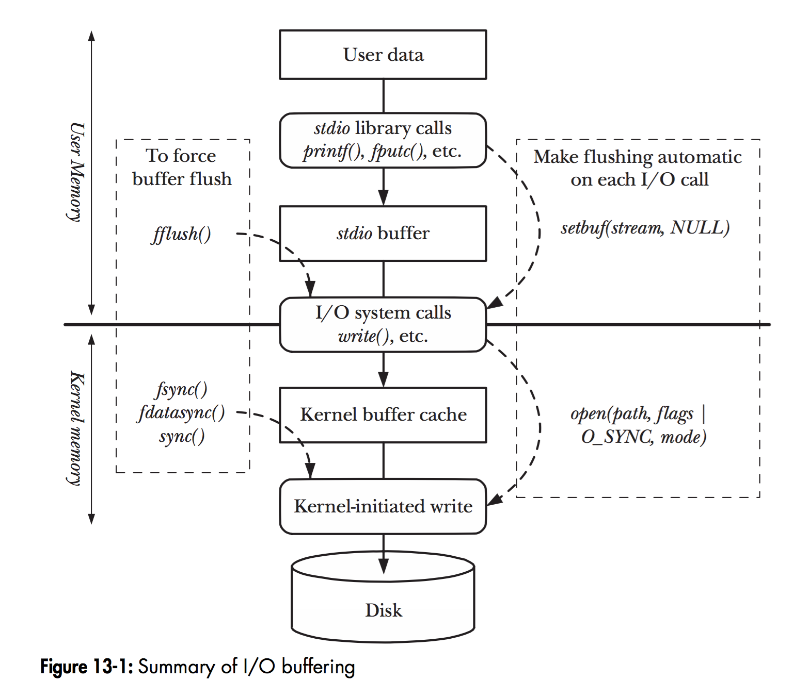

在 Linux 中 I/O 缓存其实可以细分为两个：`Page Cache` 和 `Buffer Cache`，这两个其实是一体两面，共同组成了 Linux 的内核缓冲区 (Kernel Buffer Cache) ：

- **读磁盘**：内核会先检查 `Page Cache` 里是不是已经缓存了这个数据，若是，直接从这个内存缓冲区里读取返回，若否，则穿透到磁盘去读取，然后再缓存在 `Page Cache` 里，以备下次缓存命中；
- **写磁盘**：内核直接把数据写入 `Page Cache`，并把对应的页标记为 `PG_dirty`，添加到 dirty list 里，然后就直接返回，内核会定期把 dirty list 的页缓存 flush 到磁盘，保证页缓存和磁盘的最终一致性。

`Page Cache` 会通过页面置换算法如 LRU 定期淘汰旧的页面，加载新的页面。可以看出，所谓 I/O 缓冲区缓存就是在内核和磁盘、网卡等外设之间的一层缓冲区，用来提升读写性能的。

#### Direct I/O

与 Buffered I/O 相对的是 Direct I/O，这种 I/O 要求操作系统绕过 Page Cache 直接和块设备进行 I/O 交互，也就是再也不需要存储额外的缓存数据在内存中，所以也不需要那些 writeback 机制和预读策略等。这部分内容会放到后面的 Zero Copy 的那一章中介绍，这里就先略过。

### 映射层（Mapping Layer）

映射层是 VFS 和 Page Cache 下面的一个逻辑层，主要由各种文件系统 (Ext2/3/4、BtrFS、XFS 等等) 和块设备文件组成。这一层的主要职责是在 I/O 操作的过程中提供映射功能：

1. 内核通过映射层先确定文件所在的文件系统或者块设备文件上的块大小，然后根据文件所分布的磁盘块数量计算请求的数据长度。在这一阶段，内核还会通过文件描述符 (fd) 找到存储文件数据的所有逻辑块编号。
2. 紧接着，映射层需要调用文件系统提供的特定映射函数 (也就是 `inode_operations` 中的函数) 并通过文件描述符 (fd) 访问到磁盘上的 inode，然后根据逻辑块编号找到真正的物理块编号从而找到文件所在的实际物理磁盘位置。需要注意的是，因为文件在物理块设备 (比如磁盘) 中的分布不一定是连续的，所以文件系统会记录所有逻辑块和物理块之间的映射关系，这些关系会保存在 inode 中。

### 通用块层（Generic Block layer）

通用块层 (GBL) 是一个内核组件，负责为系统中的所有块设备处理 I/O 请求。GBL 通过定义了一系列的函数，为 Linux I/O 系统提供以下的功能[28](https://strikefreedom.top/archives/linux-io-stack-and-zero-copy#user-content-fn-28)：

- 将数据缓冲区放在高端内存 (如果存在) —— 仅当 CPU 访问其数据时，才将页框映射为内核中的线性地址空间，并在数据访问完后取消映射。
- 通过一些附加手段，实现一种称之为"零拷贝"的模式，将磁盘数据直接存储在用户态的地址空间而非内核态的地址空间；事实上，内核为 I/O 数据传输使用的缓冲区所在的页框就映射在用户态的线性地址空间上。
- 管理逻辑卷 (logical volumes) —— 比如那些由 LVM (the Logical Volume Manager，逻辑卷管理器) 和 RAID (Redundant Array of Inexpensive Disks，廉价磁盘冗余阵列) 使用的逻辑卷：几个磁盘分区，即使位于不同的块设备中，也可以被看作是一个单一的分区。
- 发挥大部分新磁盘控制器的高级特性，例如大主板磁盘高速缓存、强化型 DMA 性能、I/O 传输请求调度等。

GBL 的核心数据结构是 `bio` 结构体[29](https://strikefreedom.top/archives/linux-io-stack-and-zero-copy#user-content-fn-29)：

```c
struct bio {
	struct bio		*bi_next;	/* request queue link */
	struct block_device	*bi_bdev;
	unsigned short		bi_vcnt;	/* how many bio_vec's */

	...

	/*
	 * Everything starting with bi_max_vecs will be preserved by bio_reset()
	 */

	unsigned short		bi_max_vecs;	/* max bvl_vecs we can hold */

	atomic_t		__bi_cnt;	/* pin count */

	struct bio_vec		*bi_io_vec;	/* the actual vec list */

	struct bio_set		*bi_pool;

	/*
	 * We can inline a number of vecs at the end of the bio, to avoid
	 * double allocations for a small number of bio_vecs. This member
	 * MUST obviously be kept at the very end of the bio.
	 */
	struct bio_vec		bi_inline_vecs[];
};
```

`bio` 是块设备 I/O 操作的抽象，它为上层屏蔽了底层不同的块设备驱动的实现细节，将 I/O 操作统一化了。就如同前面介绍的 VFS 所做的事情一样。`bio` 描述了从上层提交过来的一次活跃的 I/O 操作，由一系列片段 (segment) 组成的链表。一个片段代表一小块连续的内存 buffer，也就是说某些单独的 buffer 就不要求一定得是连续内存，通过使用片段来描述这些 buffer，`bio` 不仅能描述简单的单一且连续的块 I/O 操作，而且能描述多重且分散的块 I/O 操作，也就是 vector I/O 向量 I/O，使得内核可以处理这些不同的块 I/O 操作。


`bio` 中的每个片段都是由一个 `bio_vec` 结构体表示[30](https://strikefreedom.top/archives/linux-io-stack-and-zero-copy#user-content-fn-30)：

```c
struct bio_vec {
	struct page	*bv_page;
	unsigned int	bv_len;
	unsigned int	bv_offset;
};
```

`bio` 结构体中的 `bi_io_vec` 字段就是指向到一个 `bio_vec` 数组，该数组由一个特定的块 I/O 操作所需要的所有片段组成。每一个 `bio_vec` 都描述了一个特定的 I/O 片段：该片段所在的物理页、块在物理页中的起始偏移地址，以及块数据的长度。这个片段就代表了一个连续的内存 buffer。`bi_vcnt` 则代表了 `bi_io_vec` 链表的长度。

当 GBL 收到一次新的块 I/O 操作请求时，就会调用 `bio_alloc()` 函数分配一个新的 `bio` 对象 (通常是由 slab 分配器分配的)，如果此时内存不足，那么内核就会使用一个备用的小内存池来分配内存。每个 I/O 请求包含一个或多个块，存储在 `bio_vec` 数组中，每一个元素都记录了当前片段在物理内存页中的实际地址，一共有 `bi_vcnt` 个片段。`__bi_cnt` 则记录了其所在的 `bio` 的引用计数，当这个值减少为 0 的时候，当前 `bio` 结构体就会被销毁，其所占用的内存也会被回收。引用计数的管理是通过以下两个函数来完成的：

```c
static inline void bio_get(struct bio *bio);
extern void bio_put(struct bio *);
```

`bio_get()` 增加计数，`bio_put()` 减少计数，内核在开始使用每一个新创建的 `bio` 的时候都需要先调用 `bio_get()`，以避免在使用过程中该 `bio` 被意外地销毁掉，使用完毕之后则要调用 `bio_put()` 减少计数，以求那些引用计数已经归零的 `bio` 能尽早被回收。`bio` 的构成如下[31](https://strikefreedom.top/archives/linux-io-stack-and-zero-copy#user-content-fn-31)：

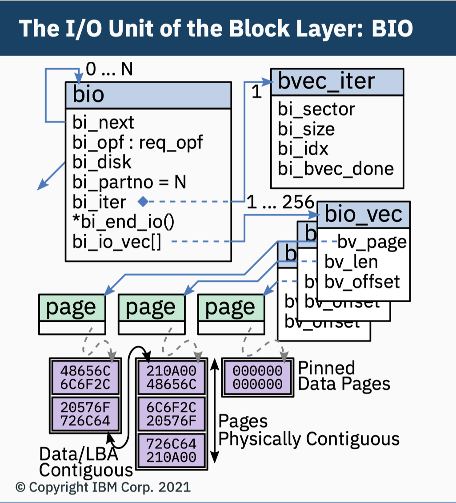

### IO 调度层（IO scheduling）

从通用块层下来的 I/O 请求并不会直接就提交到块设备驱动层，因为这些 I/O 请求的数量和顺序从执行性能上来看对于块设备来说通常不会是最优解，所以最好能把这些请求优化一下再推送到下层去。Linux 因此在通用块层和块设备驱动层之间嵌入了一个 I/O 调度层，用以对那些从上层流入的 I/O 请求进行优化 (主要是合并和排序)。

为了能更好地应对来自上层海量 I/O 请求，I/O 调度层设计了一个 staging area (暂存区)，主要的目的是为了异步处理任务以及进行流量削峰 (或者说流量控制)，为下层的块设备驱动程序缓解压力，否则的话内核有可能会被流量淹没而挂掉，暂存区是基于块设备 I/O 请求队列来实现的，这个队列由 `request_queue` 结构体表示[32](https://strikefreedom.top/archives/linux-io-stack-and-zero-copy#user-content-fn-32)：

```c
struct request_queue {
	/*
	 * The queue owner gets to use this for whatever they like.
	 * ll_rw_blk doesn't touch it.
	 */
	void			*queuedata;

	struct elevator_queue	*elevator;

	const struct blk_mq_ops	*mq_ops;

	/* sw queues */
	struct blk_mq_ctx __percpu	*queue_ctx;

	/*
	 * various queue flags, see QUEUE_* below
	 */
	unsigned long		queue_flags;

	unsigned int		rq_timeout;

	unsigned int		queue_depth;

	refcount_t		refs;

	/* hw dispatch queues */
	unsigned int		nr_hw_queues;
	struct xarray		hctx_table;

	struct percpu_ref	q_usage_counter;

	struct request		*last_merge;

	spinlock_t		queue_lock;

	int			quiesce_depth;

	struct gendisk		*disk;

	...
};
```

做过大型业务系统的读者应该对这个设计不陌生，其实对应的就是 MQ (Kafka, RabbitMQ, Pulsar 等)。

I/O 调度程序的职责是管理块设备的 I/O 请求队列，它会根据相关的算法来优化队列中的请求的顺序和数量，然后决定应该在什么时候将优化后的 I/O 请求推送到下层的块设备驱动层去。I/O 程序的优化工作基本是围绕着降低 I/O 操作的磁盘寻址时间从而提升 I/O 系统的_**全局**_吞吐量来做的，因为对于 HDD 磁盘来说，磁盘 I/O 的性能瓶颈主要集中在磁盘的寻址操作上，核心的优化策略就是合并与排序。这里之所以强调_**全局**_，是因为在优化的过程中可能无法做到公平对待每一个 I/O 请求，也就是说为了全局最优可能会牺牲掉一些局部最优，就像是选择动态规划算法 (全局最优) 而非贪心算法 (局部最优) 一样。

一个 I/O 请求可能会操作多个磁盘块，因此每个请求可以包含多个 `bio` 对象。一开始，GBL 会构建一个只含单个 `bio` 的 I/O 请求，然后 I/O 调度程序在有需要的时候要么向这个初始的 `bio` 插入一个新的片段，要么把另一个新创建的 `bio` 整个链接到初始 `bio` 的后面，从而扩展该 I/O 请求。I/O 请求队列的简化结构如下[4](https://strikefreedom.top/archives/linux-io-stack-and-zero-copy#user-content-fn-4)：

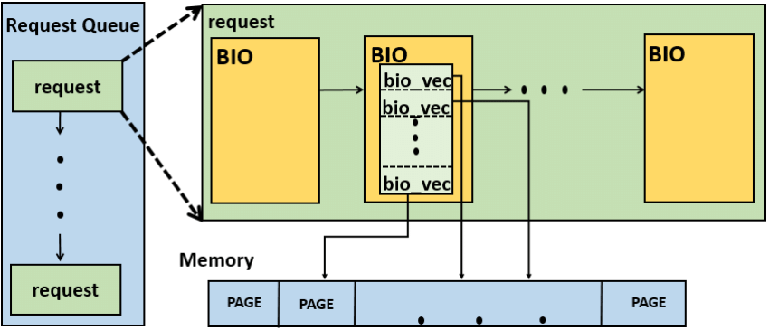

前文已经提到过，I/O 调度程序的核心优化手段就是对 I/O 请求进行合并与排序。

**合并**，是指将多个请求合并成单个的优化。我们可以通过一个例子来理解：用户进程通过 VFS 读取一个文件中的部分数据 (从底层的视角看就是读取磁盘中的块和扇区)，此时 VFS 会向下层提交一个 I/O 请求，经过层层包装和转发最终来到了 I/O 调度层进入缓冲队列，如果当前队列中已经有了另一个 I/O 请求，其请求读取的是同一个文件的数据，而且数据所在的磁盘扇区和这个新来的请求访问的磁盘扇区是相邻的 (当前扇区的紧邻的前一个扇区或者后一个)，那么这两个请求完全可以合并为一个访问多个连续扇区的新请求。请求合并之后，原先的对多次磁盘的多次寻址操作就会被压缩成一次，也就是原先的请求需要多条磁道寻址命令，现在只需要一条寻址命令就能取回所有请求的磁盘数据，大大地降低了系统开销。

**排序**，是指把那些随机访问块设备地址的 I/O 请求变得有序。还是通过一个例子来理解：假设一个 I/O 请求进入 I/O 调度层的队列之后，队列中并没有其他尝试访问与该请求的相邻扇区的 I/O 请求，看起来这种情况下 I/O 调度程序就无法做合并优化而只能选择将这个 I/O 请求插入队列尾部，但是我们再进一步思考一下，既然没有找到相邻扇区的 I/O 请求，那么可不可以退而求其次把要求降低一点，只要是相近的扇区就行，然后就按照地址增长的方向进行排序，把这两个 I/O 请求在队列中的位置调整成相邻的前后顺序。虽然因为扇区不相邻而无法像合并优化那样能够把多个 I/O 请求的多次磁道寻址操作压缩成一次，但是因为扇区是按照地址增长方向排列的，那么磁头的寻址操作就会更加方便和高效。这是什么原理呢？我们先来看一下磁盘的结构，一个磁盘由多个盘片组成的，盘片由一圈圈的多个磁道组成，每个盘片上对应一个磁头，所有磁头都焊接在一个机械臂上。磁盘的寻址操作是通过两种机械运动来实现的：盘片围绕主轴的旋转运动和机械臂控制磁头沿着盘片的半径从内向外的直线运动。前者产生的寻址延迟时间被称之为旋转时间，后者则是寻道时间。一般来说，寻道时间要远大于旋转时间，所以按顺序访问分布于同一个磁道的数据要比访问分布于不同磁道的数据快很多。即便是位于不同磁道的数据，只要是按地址增长方向去访问，磁头虽然必须走直线运动，但也只需走单一方向 —— 从内到外，如果是随机地址的访问，那磁头很可能要经常变换方向，寻址性能就会下降。这就是 I/O 调度程序的排序优化的基本原理。

HDD 机械硬盘的结构[33](https://strikefreedom.top/archives/linux-io-stack-and-zero-copy#user-content-fn-33):

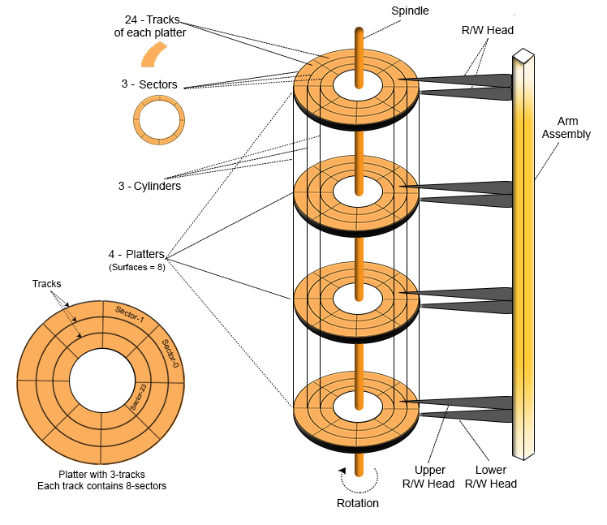

I/O 调度程序从实现上又分为单队列 (下文统一简称为 SQ) 架构和多队列 (下文简称为 MQ) 架构，分别对应 HDD 硬盘和 SSD 硬盘：单队列 I/O 调度架构服务于 HDD 硬盘，多队列 I/O 调度架构服务于 SSD 硬盘。

_**HDD**_ VS _**SSD**_[34](https://strikefreedom.top/archives/linux-io-stack-and-zero-copy#user-content-fn-34):

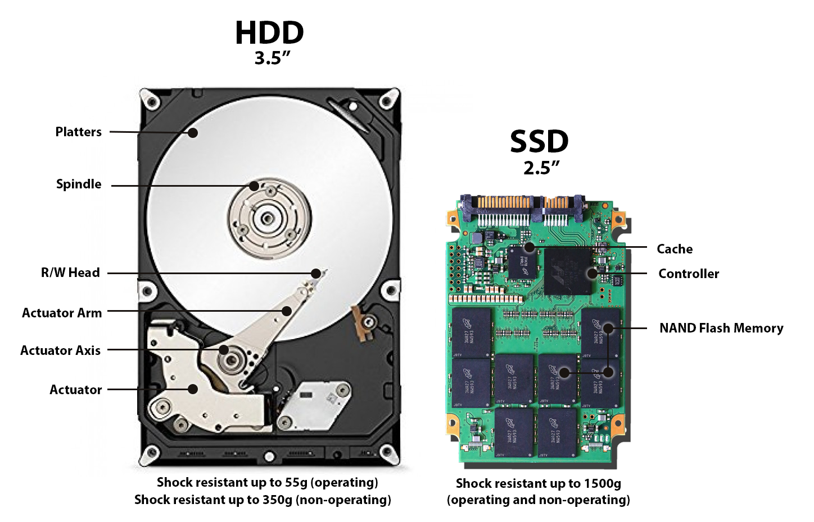

#### 单队列 I/O 调度器 (Single-queue I/O schedulers)

_**Single-queue**_ 顾名思义就是单一队列，这里的单一队列指的是硬盘的 I/O Submission 和 I/O Completion 队列，这两种队列在每一块硬盘上各配备一条，也就是全局的单一队列，所有针对该硬盘的 I/O 请求共享，早期的大部分 SATA/SAS 接口的硬盘都是这种 SQ 架构。SQ 架构很容易会让人担心存在性能瓶颈，但是在 HDD 磁盘占主流的年代，I/O 操作的性能瓶颈主要集中在磁盘本身，也就是磁盘寻址和磁盘读写，通常 HDD 的随机 I/O 只能达到几百 IOPS (input/output operations per second)，所以 SQ 架构对于 HDD 硬盘的性能需求来说已经足够了。到后来 SSD 硬盘的出现，极大地提升了磁盘本身的性能，才反转了局面，使得 SQ 架构成为了性能瓶颈，跟不上磁盘本身的速度了。关于这方面的内容，我们会在下一节讲解。

SQ I/O 调度的工作原理如下

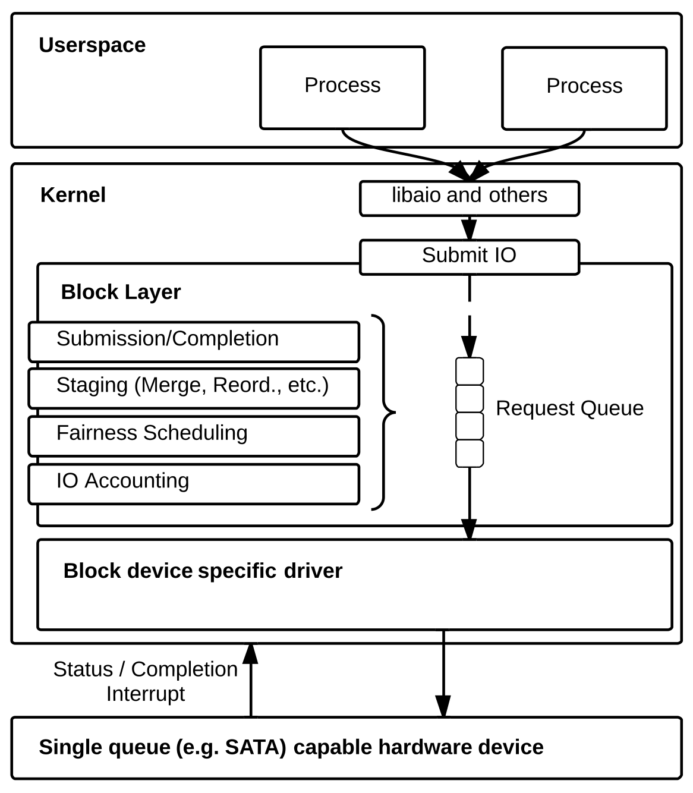

###### Linus 电梯算法

Linus 电梯算法是第一个 I/O 调度算法，在 2.4 版内核中首次引入。其原理遵循我们前面介绍的合并与排序优化：检测到新 I/O 请求进入队列的时候，它就会逐一检查当前队列中的每一个待处理的 I/O 请求是否可以与新请求合并，如果可以就合并请求；否则的话，它就会尝试按照磁盘扇区地址的顺序为这个新请求在队列中寻找合适插入点 (排序优化)，如果找到便直接插入，要是没找到合适的位置，就将其插入到队尾。

###### Deadline 算法

工作原理如下[36](https://strikefreedom.top/archives/linux-io-stack-and-zero-copy#user-content-fn-36)：

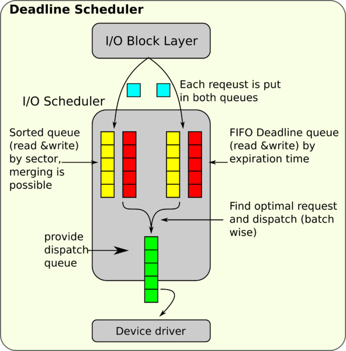

Deadline 算法是为了解决 Linus 电梯算法所带来的饥饿问题而引入的。所谓的饥饿问题，主要是由于合并和排序优化过后，很容易形成磁盘的局部热点，也就是磁盘的某一片区域的 I/O 操作过多，导致其他区域的 I/O 请求一直没有机会被执行。

2.6 版本的内核因此引入了 Deadline 算法，它的工作原理基本和 Linus 电梯算法是一样的，但是它为每一个 I/O 请求加上了过期时间，默认情况下，读请求是 500ms，写请求是 5s，之所以读请求的过期时间要远小于写请求是因为在 Linux I/O 系统中读请求要比写更重要，或者应该说更紧急，因为有 Page Cache 层的存在导致了写操作是异步(非阻塞)的，但是读操作依然还是同步(阻塞)的，所以 I/O 调度程序要尽量保证先执行读请求以求能尽快返回结果给用户进程。

这个算法中有两种队列：Sorted Queue —— 将 I/O 请求按磁盘地址排序并尝试合并，FIFO Queue —— 将 I/O 请求按过期时间排序，FIFO Queue有两条，分别存放读请求和写请求，当这两个队列头上的 I/O 请求过期之时，调度程序就会从队头把请求取下来推送到下层去执行，这样就保证了每一个请求都会有机会被处理，避免了饥饿问题；Sorted Queue 一开始也有两条，分别存放读写请求，后来的内核版本中合并成了一条。而且因为读请求的过期时间相比写请求要短得多，这个算法对多读少写的场景更加友好，因此该算法比较适合 I/O 密集的应用，比如数据库。

###### Completely Fair Queueing

工作原理如下[36](https://strikefreedom.top/archives/linux-io-stack-and-zero-copy#user-content-fn-36)：

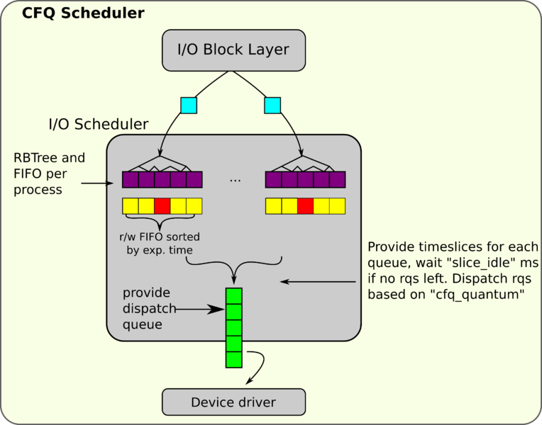

CFQ 算法的主要目标是尽量公平地把磁盘 I/O 带宽分配给所有的用户进程。它为每一个用户进程都分配了两个 I/O 请求队列：Sorted Queue 和 FIFO Queue，这两种队列的功能和 Deadline 算法中的同名队列是一样的，但是也有一些区别：前者使用红黑树实现，后者存放所有 I/O 请求。CFQ 算法以时间片轮询调度队列，每一轮都从每个队列中取出一定数量 (默认是 4，可更改) 的 I/O 请求数进行调度。这样就能保证所有进程的 I/O 请求按照一种公平的方式进行调度，每个进程分到的磁盘 I/O 带宽基本是一样的。

这个算法是专门为多媒体设备 (音视频) 和个人电脑而设计的，比如说个人电脑，用户通常会同时开启多个任务一起执行，比如写文档的时候听音乐，同时还在下载东西，这个时候要公平地协调系统的 I/O 资源，保证用户能同时执行这些任务而不会卡顿，虽说这个算法很适合多任务系统，但是因为 CFQ 算法的通用性，所以它在其他场景也能运行得很好。

###### Noop (No-operation) 算法

工作原理如下[36](https://strikefreedom.top/archives/linux-io-stack-and-zero-copy#user-content-fn-36)：

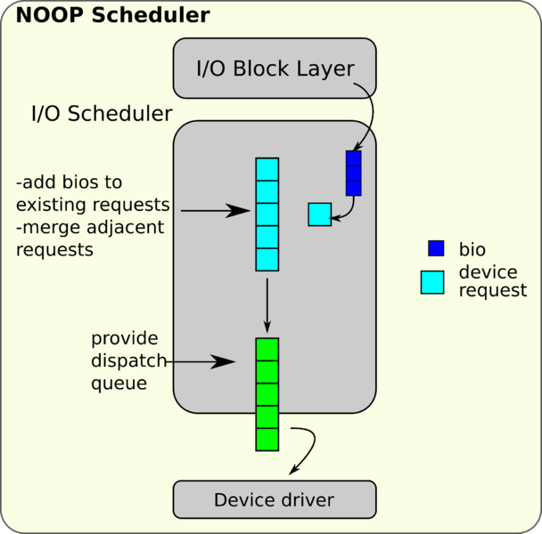

这是 I/O 调度程序实现的最简单的调度算法，其核心逻辑是只应用合并优化而放弃排序优化。这个算法是专门为随机访问设备而设计的，比如 Flash 闪存盘，RAM 盘等，也非常适合那些能够提前把 I/O 请求排好序的高级存储控制器。SQ I/O 调度程序的算法都是针对 HDD 也就是机械硬盘而优化的，而这些优化对于 SSD 固态硬盘来说基本没有什么意义了，所以 SQ 架构的 I/O 调度程序及其算法都在 5.0 版内核之后被陆陆续续地移除掉了，要发挥出 SSD 的最大性能，最好是选用下一节要介绍的 MQ 架构。_**当然，SQ I/O 调度程序在 SSD 上也可以工作，这种情况下这几种 SQ I/O 调度算法的性能差别不大，而 noop 算法反而因为实现简单而比 CFQ 和 Deadline 算法要更省 CPU 资源，因此如果一定要在 SSD 用 SQ I/O 调度的话，最好选择 noop 算法。**_

#### 多队列 I/O 调度器 (Multi-queue I/O schedulers)

随着 SSD 硬盘逐渐取代 HDD 硬盘成为主流，磁盘的 IOPS 也如同坐火箭般高速飞升，随机 I/O 的 IOPS 从原来的几百到现在的十万级甚至未来的百万级。于是局面反转了，原先的性能瓶颈在磁盘，现如今转移到了 Linux 内核的 SQ I/O 调度程序上，再加上以 [NUMA](https://en.wikipedia.org/wiki/Non-uniform_memory_access "Non-uniform memory access") (Non-Uniform Memory Access) 多核架构和 [NVMe](https://en.wikipedia.org/wiki/NVM_Express "Non-Volatile Memory express") (Non-Volatile Memory express) 通信协议的横空出世，计算机系统的多核处理与数据传输能力也与日俱增，更是进一步加剧了内核的 SQ I/O 调度架构的性能滞后。因此内核亟需引入新的 I/O 调度架构来跟上 SSD 的速度，将 SSD 的速度潜能都发挥出来。于是 Linux I/O Block Layer 的 maintainer —— [Jens Axboe](https://en.wikipedia.org/wiki/Jens_Axboe) (同时也是 CFQ/Noop/Deadline I/O 调度器、`splice()` 和 `io_uring` 的作者) 再次出手，设计了 Multi-queue I/O scheduler，补上了这一部分的性能差。

根据 Jens Axboe 等内核开发者的调研，他们总结出了 SQ I/O 调度程序在扩展性方面的三个主要的问题[35](https://strikefreedom.top/archives/linux-io-stack-and-zero-copy#user-content-fn-35)：

1. _**请求队列锁**_：SQ 在并发处理的场景下带来的是粗粒度的锁机制和激烈的锁竞争：

    1. 从队列插入或者移除 I/O 请求时需要加锁；
    2. 对 _**request queue**_ 进行其他任何操作也需要加锁；
    3. Block layer 对进行 I/O 请求进行堆积优化 (堆积 I/O 请求最后让硬件一次性处理，期间还可以对请求进行合并优化) 时需要加锁；
    4. I/O 请求重排的时候需要加锁；
    5. 对 I/O 请求进行公平性调度的时候还需要加锁；

    上述的场景全部都需要加锁才能进行，导致了剧烈的锁竞争。

2. _**硬件中断**_：高 IOPS 伴随着高频次的硬件中断，当下大部分存储设备都被设计成由一个 CPU 全权负责处理所有的硬中断，不论 I/O 请求是不是它自己发出的，它都会通过软中断的方式转发给其他 CPU。结果就是这个 CPU 需要耗费大量的时间处理硬中断、上下文切换和刷新 L1/L2 缓存 (这些缓存本来可以用来为上层应用加速其数据访问)。而且其他 CPU 也必须接受这个来自主 CPU 的 IPI (inter-processor interrupt，处理器间中断) 然后停止手头上的工作去走一遍 I/O 处理的流程 (即便这个 I/O 请求不是它发出的)。因此，在大多数情况下，仅处理一次 I/O 请求就需要两次中断和上下文切换。

3. _**远端内存访问**_：NUMA 架构下，如果处理 I/O 请求的过程中发生跨核的内存访问 (或者是跨 socket 也就是 CPU 槽)，那么队列锁竞争的情况会进一步恶化。不幸的是，当一个 I/O 请求最终被交付给另一个 CPU 而非那个最开始发起 I/O 请求的那个 CPU 时，这种远端内存访问就必定会发生。那样的话，根据 MESI 协议[37](https://strikefreedom.top/archives/linux-io-stack-and-zero-copy#user-content-fn-37)，一个 CPU 尝试加锁去取队列中的 I/O 请求的行为就会触发一个远端内存访问到那个最后加锁成功并保存锁状态到其缓存行中的 CPU，然后这个 CPU 缓存就会被标记成共享状态并最终导致缓存失效。如果多个 CPU 一直在发起 I/O 请求然后竞争队列锁，那么锁状态就会一直在多个 CPU 缓存之间反复横跳，极大地降低 CPU 的处理效率。

基于以上的原因，内核团队为 [NUMA](https://en.wikipedia.org/wiki/Non-uniform_memory_access "Non-uniform memory access") 架构的机器重新设计了一个全新的 MQ I/O 调度层，主要的目标和难点是降低锁粒度 (减少锁竞争) 和跨核内存访问[35](https://strikefreedom.top/archives/linux-io-stack-and-zero-copy#user-content-fn-35)：

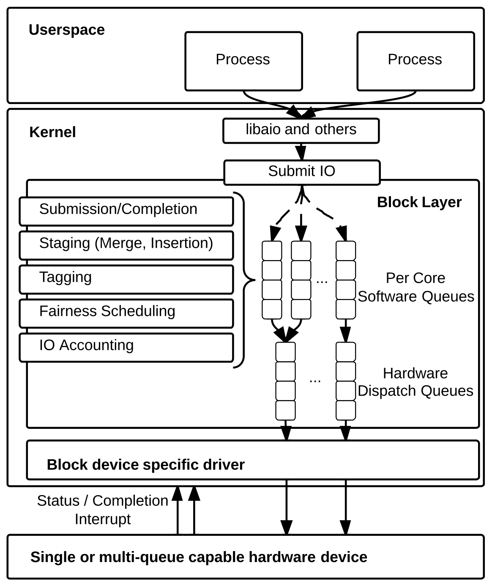

既然要改造旧系统，那么必须先明确我们的需求和目标，也就是我们期望新架构最终能达成哪些成果，内核团队提出的主要需求是[35](https://strikefreedom.top/archives/linux-io-stack-and-zero-copy#user-content-fn-35)：

1. **保证单个设备上的 I/O 公平性**：多个用户进程可能会共享一块设备，为了避免某一个进程的 I/O 操作一直占用设备导致其他进程被饿死，内核的 Block Layer 需要解决这个问题。以往的 SQ 架构中，会使用 CFQ 和 Deadline 等算法对请求进行合并与排序来保证这个公平性。如果 Block Layer 不做这个事情的话，那么就要么需要上层的多个用户程序协调彼此的执行顺序，要么就让硬件设备的内部实现来保证 I/O 的公平性 (事实上现在的大多数 SSD 都有这个功能)。
2. **提供更友好的存储设备 accounting (中文里没有很好的对应翻译，其实就是能更方便地提取设备运行过程中的监控和统计数据)**：Block layer 应该要为系统管理员提供更方便的手段去调试和监控存储设备。最好是能提供一个统一的性能监控和统计的接口，可以让用户程序和内核组件能够利用这个接口去实现一些优化策略：程序调度、负载均衡和性能调优。
3. **设置块设备 I/O 的暂存区**：前面我提到过 SQ 架构里的队列的核心功能之一就是进行流量控制 (削峰)，MQ 架构下也同样需要一个 staging area 暂存区，有了它，我们不仅可以缓冲海量的 I/O 请求以便我们对它们进行合并和排序优化，而且还能在底层设备过载的时候，调控 I/O 请求的速率，进行限流，以减轻设备的压力，避免引发硬件问题。

明确了需求之后，我们就可以着手设计新架构了，整个架构的核心是一个两级队列的设计，通过引入这个两级队列来降低队列锁粒度和减少锁竞争，同时还能简化原先那复杂的调度算法，将部分系统复杂度下沉到硬件设备层，其核心要点分为软件和硬件两个层面[35](https://strikefreedom.top/archives/linux-io-stack-and-zero-copy#user-content-fn-35)：

1. _**Software Staging Queues 软件暂存队列**_ (下文简称为 SSQ)：将原来的那个 SQ I/O 队列改造成可调整的 MQ (可配置任意的队列数量，甚至可以退化成单队列)，同时为 NUMA 的每一个 socket (CPU 槽) 配备一个 I/O 队列，也可以为每一个 core 配备一个。这样的话，一个带有 4 个 6 核的 sockets 的 NUMA 系统，它的 I/O 队列数的范围在 4 ~ 24 个之间。如此便能极大地减少锁竞争。在多数 CPU 都提供了大容量 L3 cache 的现状下，一个 socket 里的多个 cores 即便是共享 L3 也足够快了，没必要让每个 core 再独占一个 I/O queue。所以每个 socket 配备一个 I/O queue 通常是一个性价比较高的选择。
2. _**Hardware Dispatch Queues 硬件调度队列**_ (下文简称为 HDQ)：I/O 请求从 SSQ 出来之后，不会被直接推送给下层的块设备驱动程序，而是会被发送到一个硬件调度队列 HDQ，这个队列是由磁盘驱动提供的，队列数量通常取决于设备驱动支持的硬件上下文 (contexts) 数量，设备驱动会基于 MSI-X (Message Signal Interrupts) 标准提供 1 ~ 2048 个队列。大部分 SSD 只提供了一个队列。在针对 SSD 的 MQ 架构下，通常不再需要 I/O 请求基于磁盘地址保持全局有序，也就是可以不用再执行排序优化了，而是让硬件为每一个 NUMA node 或者 CPU 配备一个本地队列从而避免跨核内存访问。

* 硬件调度队列 HDQ 的数量

HDQ 的数量在内核的 I/O Scheduling 架构的演变过程中可以说是扮演着核心角色，**单队列和多队列架构指的就是 HDQ 的数量**。这个地方特别容易引起混淆，所以要专门澄清一下：很多人以为 SQ 和 MQ 指的是的内核的 _**request queue**_ (也就是 SSQ，软件层面)，实际上这两个概念真正代表的是硬盘的 I/O Submission 和 I/O Completion 队列 (也就是 HDQ，硬件层面)。如果不理解这一点，那么很容易在阅读上一节内容的时候感到困惑：如果 SQ 指的是 _**request queue**_，虽然 noop 和 deadline 算法可以算是单一 request queue，但是 CFQ 算法明显有多条 request queues，怎么也算到 SQ 架构里了？因此，在这里要拨乱反正，SQ 和 MQ 是针对 HDQ 提出来的概念。

目前，SATA 协议的 SSD 只支持单 I/O 队列 (一条 I/O Submission 队列和一条 I/O Completion 队列)，队列长度 32 (也就是 [TCQ](https://en.wikipedia.org/wiki/Tagged_Command_Queuing "Tagged Command Queuing") 和 [NCQ](https://en.wikipedia.org/wiki/Native_Command_Queuing "Native Command Queuing"))；SAS 协议的 SSD 可以支持最多 256 条长度为 256 的队列，而 [NVMe](https://en.wikipedia.org/wiki/NVM_Express "Non-Volatile Memory express") 协议的 SSD 则支持最多 64K 条长度为 64K 的队列[38](https://strikefreedom.top/archives/linux-io-stack-and-zero-copy#user-content-fn-38)。

相信各位都能看出来 NVMe 在这几种主流的 SSD 协议/接口中是鹤立鸡群的存在。事实上，NVMe 作为一种专为 SSD 而生的协议，其技术非常出众，在存储空间、读写速度和兼容性方面都优于其他的协议，IOPS 最高能达到百万级。这其中，I/O 队列的设计可谓是居功至伟：NVMe 为每个 CPU 核心提供至少一个 I/O Submission 和 I/O Completion 队列，这种多队列设计相较于单队列可以避免核心之间的锁竞争，在 NUMA 架构下还能避免跨核内存访问，进一步提升性能。NVMe 还支持了 Vector I/O，最大限度地减少了跨核数据传输的开销，甚至可以根据工作负载调整 I/O 优先级。

NVMe 多 I/O 队列设计[39](https://strikefreedom.top/archives/linux-io-stack-and-zero-copy#user-content-fn-39):

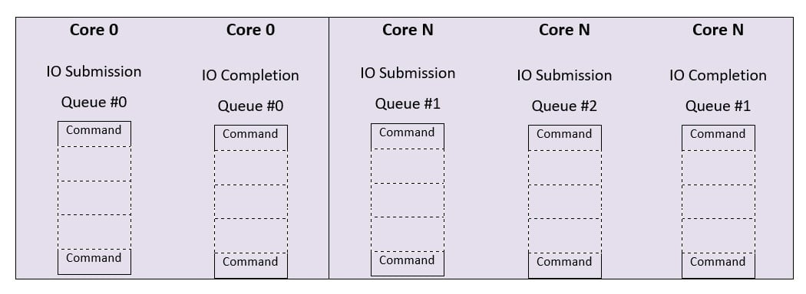

虽然未必所有的 Linux 设备都能用上基于 NVMe 协议的 SSD 的多 HDQ，但是 Linux 的 I/O 调度程序经过改造之后，从 SQ 架构转向了 MQ 架构，设计了多个 SSQ 取代了原先的单一 Request Queue，因此即便所用的硬盘上只有一条 HDQ，从 SQ I/O 架构切换到 MQ 架构还是能带来可观的性能提升。

* Tagged I/O & I/O Accounting

SSD 的工作原理可以简单地概括如下[40](https://strikefreedom.top/archives/linux-io-stack-and-zero-copy#user-content-fn-40)：

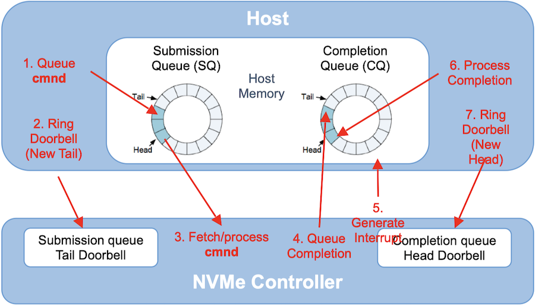

主机往其内存 (或者硬盘的内存) 中的 I/O Submission 环形队列写进一个 I/O 命令 (command, 主机驱动硬盘工作的原理就是通过一个个的 I/O command)，同时往一个叫 doorbell 的寄存器里写入一个 I/O 命令就绪的信号，然后 NVMe SSD 的控制器按照命令的接收顺序或优先级顺序从队列中取出 I/O 命令并执行，完成之后便往 I/O Completion 队列写入命令已完成的状态，随后向主机发出一个中断信号。主机收到之后会记录下 I/O Completion 队列中的命令已完成状态，最后清除掉 doorbell 寄存器里的内容。

上述的这个过程在早期的时候是没有对 I/O 命令进行标记的，所以导致命令完成之后，I/O 调度程序还要对队列进行线性扫描，找到已完成的命令，有点低效，后来在 NCQ 技术被引入 SSD 之后，支持了给 I/O 命令生成一个整型数标签 (范围是 [0, len(HDQ)])，然后在命令执行完成之后被回传给内核，这样内核就能通过这个标签直接定位到是哪个 I/O 命令执行完了。内核的 MQ I/O 调度程序在这里还做了一个优化：在内核的软件层就提前生成了每个 I/O 命令的标签并随之一起推送到 HDQ 里，这样的话 SSD 就不用自己生成标签了，直接复用就行。

另外值得一提另一个优化是优化了内核的 accounting 库，以此实现了更加细粒度的统计功能，同时考虑了 SSQ 和 HDQ；而且还修改了 blktrace 现有的 tracing 和 profiling 机制，以适配那些多队列的 SSD 设备。

* 软硬件分离的 I/O 调度

I/O 调度层的两个主要的优化手段：合并与排序，其中排序是专门针对 HDD 硬盘的优化。前面我已经讲解过机械硬盘的寻址过程，HDD 的 I/O 寻址是基于机械运动，受限于物理盘片、磁头和机械臂，所以其随机 I/O 的性能比较差，从 HDD 的结构上也能看出来，如果执行随机 I/O 需要不断地驱动机械臂移动磁头以及转动盘片，效率很低，所以早期的内核 I/O 调度才需要设计专门的算法对 I/O 请求进行排序，其本质就是避免随机 I/O，优先执行顺序 I/O，提升性能。但是 SSD 硬盘完全由电子元件组成，其中三个核心组件是 NAND 闪存 (flash) 或者 DRAM、主控芯片 (控制器)、固件。所以 SSD 的 I/O 是基于电磁原理甚至是量子力学，其内部寻址和读写都是通过主控芯片利用固件程序执行数据读写、自动信号处理、耗损平衡、错误校正码 (ECC)、坏块管理、垃圾回收算法、与主机设备(如电脑)通信，以及执行数据加密等任务。因此即便 SSD 的存储还是基于块 (block) 的，但是随机寻址对于 SSD 来说已经不是什么性能瓶颈了，虽然顺序 I/O 通常还是要比随机 I/O 更快一点，但二者可以说基本持平，不会有 HDD 那样的数量级差距。

基于上述的事实，既然使用 SSD 的随机 I/O 基本不会拖累性能，而且随着 [TCQ](https://en.wikipedia.org/wiki/Tagged_Command_Queuing "Tagged Command Queuing") 和 [NCQ](https://en.wikipedia.org/wiki/Native_Command_Queuing "Native Command Queuing") 等技术的出现，软件层面的 I/O 请求排序也变得越来越没有价值，于是内核的 MQ I/O 调度程序开始摒弃那些早期的复杂排序算法，而只是简单地基于 FIFO 原则将每一个 I/O 请求按顺序插入到发出该请求的 CPU 的专属 SSQ 中，然后执行合并、打标签和其他优化之后就推送到 HDQ 中，让块设备直接去执行。MQ I/O 调度程序之所以摒弃排序优化而保留合并优化，是因为合并优化的收益更大，因为即便是在 SSD 上，多个小 I/O 请求合并成一个大请求对性能的提升也是立竿见影的。当然，MQ 架构并没有把排序优化完全封死，还是预留了对 MQ 的全局重排序的可能性，如果磁盘制造商想再进一步把随机 I/O 重排成顺序 I/O 从而再加速一下读写的话，则可以自己在固件程序中实现排序优化，就算是要把排序优化重新加回到内核的 I/O 调度程序中，内核维护者们也是持开放态度的。最后通过将这部分的系统复杂度下沉到硬件层，MQ I/O 调度程序的实现更加的精简和高效。

* Multi-Queue Block IO Queueing Mechanism (blk-mq)

最后就是 MQ 架构在内核中的各种具体实现了。_**blk-mq**_ 是内核的 Block Layer 中多 I/O 队列框架，也就是我们这一章节所述原理的具体实现。

###### _**MQ-Deadline Scheduler**_

MQ-Deadline 是内核从 SQ 往 MQ 架构转变的过程中的第一个 MQ 实现，这个 mq-deadline scheduler 是直接从 SQ 中的 deadline scheduler 重构而来的一个改版，专门针对多队列设备而改造，其特定是通用性很好、实现简单、调度过程中 CPU 开销很低。

###### _**BFQ (Budget Fair Queueing) Scheduler**_

BFQ 调度器在 4.12 内核中首次实现[41](https://strikefreedom.top/archives/linux-io-stack-and-zero-copy#user-content-fn-41)，是一种"比例配额" (proportional-share) 的低延迟 I/O 调度器，支持 cgroups。代码实现很复杂，所以调度过程中的 CPU 开销比较大，同时追求 I/O 调度的低延迟 (尤其是在那些速度较慢的块设备上)，为了达成这个目标甚至可以牺牲掉 I/O 的吞吐量，因此这个调度器并不适合那些 CPU 性能较差或者硬盘吞吐量较高的设备。

BFQ 的架构是从 CFQ 借鉴过来的，同时也借鉴了大量的代码。其公平性调度是主要是基于 I/O 请求的扇区数 (HDD 的说法，SSD 的话则是**储存颗粒**，总之本质是数据多少)，而不是时间片 (当需要保持高吞吐量的时候可能会切换成时间片)，它会将设备的带宽按权重比例在进程(组)之间进行分配，权重的计算和进程的工作负载和其他设备参数都无关，只和 I/O 请求的优先级有关；工作方式是启发式调度。BFQ 在默认配置下会优先考虑延迟而不是吞吐量，所以如果你的场景是高吞吐量，那么就需要关闭所有低延迟的启发式方法的选项：将 `low_latency` 设置为 0[42](https://strikefreedom.top/archives/linux-io-stack-and-zero-copy#user-content-fn-42)。关于如何在延迟和吞吐量之间权衡配置，以官方文档为准。

BFQ 比较适合多媒体设备，比如个人电脑，或者是一些为实时应用服务的后端服务器，比如视频直播、游戏等。事实上，如果使用了比较高端的 SSD 设备，由于 SSD 内部有足够多的硬件优化，内核 (软件层) 的 I/O 调度能带来的性能提升相比之下可能是小巫见大巫了，再考虑到 I/O 调度引入的复杂性，这种情况下使用另一个简单一点的调度器可能是更好的选择。

###### _**Kyber I/O Scheduler**_

Kyber 调度器也是在 4.12 内核中实现的[41](https://strikefreedom.top/archives/linux-io-stack-and-zero-copy#user-content-fn-41) (和 BFQ 调度器一起)，也是一种较复杂的调度器，但这个复杂是相对 mq-deadline 以及下一节要介绍的 none 调度器而言的，如果是和 BFQ 对比，那这点复杂度是不足为惧的，其实现代码还不到一千行。Kyber 专为高性能的多队列设备设计，旨在提供高吞吐量的同时尽量兼顾延迟时间，同时其 CPU 开销也会比较高。

其内部有两个 I/O 请求队列，分别存放同步请求(读)和异步请求 (写)，然后只进行一些简单的优化策略比如合并请求。正如我们在前文提到过的，前者的优先度要高于后者，因此 kyber 会优先调度读请求，但是它也会通过其他策略来规避写请求饿死的问题。Kyber 算法的一个核心逻辑就是严格限制发送到 HDQ 的 I/O 请求数量，因此 HDQ 的长度会很短，也就缩短了每个请求在队列中的停留时间，所以 I/O 请求 (尤其是高优先级的请求) 能被更快地推送到块设备上去执行。

由于 kyber 没有加入过多复杂的调度逻辑，实现相对简单，因此能较大程度地发挥出 SSD 的高吞吐能力，因此更加适合那些 I/O 密集型的应用，比如数据库。值得一提的另一个点是，kyber 算法虽然简单，但可以看做是对网络栈中的 [bufferbloat](https://en.wikipedia.org/wiki/Bufferbloat) (缓冲区肿胀) 设计的一种反向思维，也因此它理论上能够在 I/O 拥塞时尽量避免 I/O 请求在队列中长期滞留[41](https://strikefreedom.top/archives/linux-io-stack-and-zero-copy#user-content-fn-41)。

###### _**None**_

最后也是最简单的一种调度器，基本原理和 SQ 架构下的 noop 算法一致：用来缓冲 I/O 请求的队列是 FIFO，而且不执行排序优化，只做合并优化。None 基本上就是把 noop 进行多队列的改造，为每一个 CPU core 或者 NUMA node 配备一个本地 FIFO 队列，避免跨核内存访问和锁竞争。本质上来说，None 就是一个简单的中转程序，把绝大部分的复杂度下沉到硬件设备中，将所有 I/O 工作都交给块设备区完成。

虽然 none 算法的极其简单，但是却非常适合用在 NVMe 协议的 SSD 上，因为这种 SSD 本身的随机 I/O 性能极高，与顺序 I/O 相比不遑多让，因此软件层的调度优化反而是越简单越好。而且未来随着NVMe SSD 的普及，None I/O Scheduler 这样策略简单的调度器可能反而会后来居上，成为内核中首选的调度器。

#### 默认 I/O scheduler

Linux 5.0 之前的版本默认是使用单队列 I/O 调度器 —— deadline、cfq 和 noop。内核 5.0 之后则默认使用多队列 I/O 调度器 —— mq-deadline、bfq、kyber 和 none。

从内核 5.3 开始，单队列 I/O 调度器就被全部移除了，之前的内核版本如果想要切换回单队列 I/O 调度的话，可以通过修改内核参数来实现。这里以 Ubuntu 系统为例，执行以下的命令查看当前是否开启了多队列 I/O 调度：

```bash
[root@localhost ~] cat /sys/module/scsi_mod/parameters/use_blk_mq
Y
[root@localhost ~] cat /sys/module/dm_mod/parameters/use_blk_mq
Y
```

输出 `Y` 则表示开启了 blk-mq 调度，如果是 `N` 则表示关闭，这里 `scsi_mod` 和 `dm_mod` 分别表示 SCSI 设备和 [DM-Multipathing](https://en.wikipedia.org/wiki/Linux_DM_Multipath)。如果要关闭 blk-mq，可以修改 `/etc/default/grub` 中的 `GRUB_CMDLINE_LINUX_DEFAULT` 字符串，加上 `scsi_mod.use_blk_mq=N` 和 `dm_mod.use_blk_mq=N`，然后执行 `sudo update-grub` 使配置生效 (要谨慎操作)。

如果是要切换多队列 I/O 调度器，通常是在某一块磁盘上操作的。这里以我的 Ubuntu 22.04 服务器来举例，内核版本是 5.15，配备了 NVMe 硬盘。先查看当前的默认 I/O 调度器：

```bash
cat /sys/block/vda/queue/scheduler
[mq-deadline] none
```

可以看到当前默认的多队列 I/O 调度器是 mq-deadline，另外还有一个 none。这里可能会有疑问：为什么没有前面介绍过的 bfq 和 kyber？是因为这两个 I/O 调度器是作为内核模块存在的，而且默认没有安装，需要手动安装，方法也很简单，使用 `modprobe` 命令就能安装：

```bash
sudo modprobe kyber-iosched
sudo modprobe bfq
cat /sys/block/vda/queue/scheduler
[mq-deadline] kyber bfq none
```

切换默认的 I/O 调度器也很简单，就是通过 `echo` 命令更新 `/sys/block/vda/queue/scheduler` 即可。比如要切换到 bfq 调度器，可以执行以下命令：

```bash
echo "bfq" | sudo tee /sys/block/vda/queue/scheduler
```

同理，如果是要切换到 kyber，则执行：

```bash
echo "kyber" | sudo tee /sys/block/vda/queue/scheduler
```

前面我就讲过，如果是 SSD 硬盘，特别是 NVMe 的硬盘，因为硬盘本身的硬件性能已经非常高了，相比之下软件层面 (内核) 的 I/O 调度就不是特别重要了，除了一些特定的使用场景，通常用一些像 none 和 mq-deadline 这一类比较简单的 I/O 调度算法就足够了，使用 kyber 也是个不错的选择但是可能要对其内核参数进行调优，否则可能也会折损性能，使用复杂的 bfq 算法可能反而会事倍功半。我读过一篇对 Linux 上的多队列 I/O 调度器进行实测的论文，作者们针对 Linux 的blk-mq 调度器 —— mq-deadline、bfq、kyber 和 none 在 NVMe SSD 上的性能、开销和扩展性进行了全方位的测试。根据这篇论文的结论，在 NVMe SSD 上使用调优过的 kyber 调度器性能最高、扩展性最好，同时 CPU 开销也最低[43](https://strikefreedom.top/archives/linux-io-stack-and-zero-copy#user-content-fn-43)。

### 块设备驱动层（Block Devices Driver）

块设备驱动层是 Linux 内核 Block 子系统管辖范围内的最低的一层，而块设备驱动程序则是 Block subsystem 中最底层的组件，驱动程序负责对接底层的硬件设备，Linux 中负责绝大部分的持久存储控制器的块设备驱动程序是 SCSI (Small Computer Systems Interface) 驱动程序，其所在的地方就是 SCSI layer，是 Linux 的一个子系统，负责使用 SCSI 协议和底层的存储设备通信，也就是为内核提供与 SCSI 存储设备的软件接口。

[SCSI](https://en.wikipedia.org/wiki/SCSI) 协议是一组规定如何在计算机和外围设备之间传输数据的标准，广泛应用在硬盘、磁带和光盘等存储设备上。Linux 内核专门实现了一整个 SCSI 子系统来管理绝大多数的底层存储设备。

SCSI 驱动程序会将 I/O 调度层推送下来的 I/O 请求转换成 SCSI 命令 (也就是上一章的 "Tagged I/O & I/O Accounting" 一节中的 I/O command)，然后提交到 I/O Submission HDQ 发送给块设备去处理。块设备按要求执行这些命令，完成之后便往 I/O Completion 队列写入命令已完成的状态并向主机 (请求方) 发出一个中断，中断处理程序收到以后就会调用预先设置好的中断回调函数释放一些占用的资源并把数据返回给上层。

### 块设备硬件层（Block devices）

这一层就是物理设备层，也就是我们熟悉的 HDD、SDD 等内嵌设备，还有其他的外部设备比如外接硬盘，U 盘等。

## 源码分析

TODO

# IO 模式

* 轮询 I/O

这是最简单的一种 I/O 模式，用户通过发起一个系统调用，陷入内核态，内核将调用设备驱动程序，接着设备驱动程序启动 I/O 不断循环检查该设备，看看是否已经就绪，一般通过返回码来表示，I/O 结束之后，设备驱动程序把数据送到指定的地方并返回，切回用户态。

比如：系统调用 `recvfrom()`

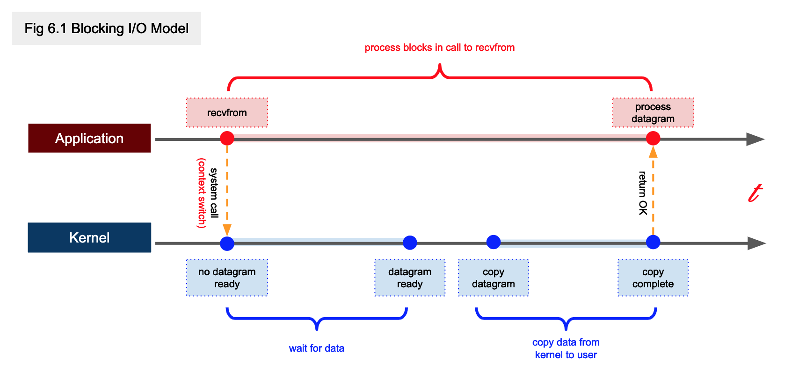

* 中断 I/O

1. 用户进程发起一个 `read()`/`recv()`/`recvfrom()`/`recvmsg()` 系统调用读取磁盘文件，陷入内核态并由其所在的 CPU 通过设备驱动程序向设备寄存器写入一个通知信号，告知设备控制器 (我们这里是磁盘控制器)要读取数据；
2. 磁盘控制器启动磁盘读取的过程，把数据从磁盘拷贝到磁盘控制器缓冲区里；
3. 完成拷贝之后磁盘控制器会通过总线发送一个中断信号到中断控制器，如果此时中断控制器手头还有正在处理的中断或者有一个和该中断信号同时到达的更高优先级的中断，则这个中断信号将被忽略，而磁盘控制器会在后面持续发送中断信号直至中断控制器受理；
4. 中断控制器收到磁盘控制器的中断信号之后会通过地址总线存入一个磁盘设备的编号，表示这次中断需要关注的设备是磁盘；
5. 中断控制器向 CPU 置起一个磁盘中断信号；
6. CPU 收到中断信号之后停止当前的工作，把当前的 PC/PSW 等寄存器压入堆栈保存现场，然后从地址总线取出设备编号，通过编号找到中断向量所包含的中断服务的入口地址，压入 PC 寄存器，开始运行磁盘中断服务，把数据从磁盘控制器的缓冲区拷贝到主存里的内核缓冲区；
7. 最后 CPU 再把数据从内核缓冲区拷贝到用户缓冲区，完成读取操作，`read()` 返回，切换回用户态。

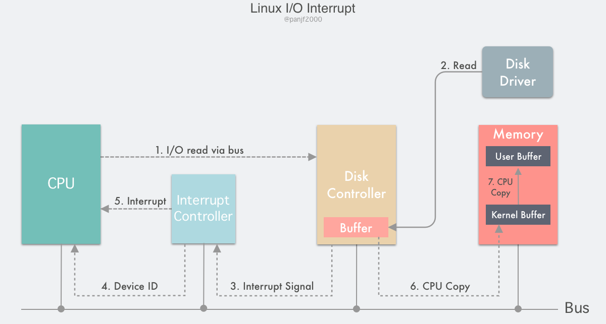

* DMA I/O

并发系统的性能高低究其根本，是取决于如何对 CPU 资源的高效调度和使用，前面的中断 I/O 模式的流程，第 6、7 步的数据拷贝工作都是由 CPU 亲自完成的，也就是在这两次数据拷贝阶段中，CPU 被完全占用而不能处理其他工作的；第 7 步的数据拷贝是从内核缓冲区到用户缓冲区，都是在主存里，所以只能由 CPU 亲自完成，但是第 6 步的数据拷贝，是从磁盘控制器的缓冲区到主存，是两个设备之间的数据传输，这一步并非一定要 CPU 来完成，可以借助 DMA 来完成，减轻 CPU 的负担。

DMA (Direct Memory Access，直接存储设备存取)，是一种用来提供在外设和存储设备之间或者存储设备和存储设备之间的高速数据传输。整个过程无须 CPU 参与，数据直接通过 DMA 控制器进行快速地移动拷贝，节省 CPU 的资源去做其他工作。

目前，大部分的计算机都配备了 DMA 控制器，而 DMA 技术也支持大部分的外设和存储设备。借助于 DMA 机制，计算机的 I/O 过程就能更加高效：

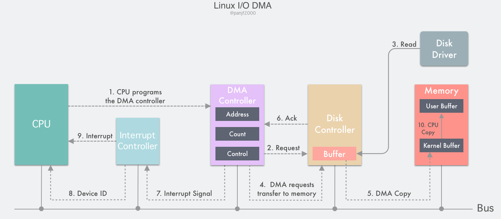

DMA 控制器内部包含若干个可以被 CPU 读写的寄存器：一个主存地址寄存器 MAR (存放要交换数据的主存地址) 、一个外设地址寄存器 ADR (存放 I/O 设备的设备码，或者是设备信息存储区的寻址信息) 、一个字节数寄存器 WC (对传送数据的总字数进行统计) 、和一个或多个控制寄存器。

1. 用户进程发起一个 `read()`/`recv()`/`recvfrom()`/`recvmsg()` 系统调用读取磁盘文件，陷入内核态并由其所在的 CPU 通过设置 DMA 控制器的寄存器对它进行编程：把内核缓冲区和磁盘文件的地址分别写入 MAR 和 ADR 寄存器，然后把期望读取的字节数写入 WC 寄存器，启动 DMA 控制器；
2. DMA 控制器根据 ADR 寄存器里的信息知道这次 I/O 需要读取的外设是磁盘的某个地址，便向磁盘控制器发出一个命令，通知它从磁盘读取数据到其内部的缓冲区里；
3. 磁盘控制器启动磁盘读取的过程，把数据从磁盘拷贝到磁盘控制器缓冲区里，并对缓冲区内数据的校验和进行检验，如果数据是有效的，那么 DMA 就可以开始了；
4. DMA 控制器通过总线向磁盘控制器发出一个读请求信号从而发起 DMA 传输，这个信号和前面的中断 I/O 小节里 CPU 发给磁盘控制器的读请求是一样的，它并不知道或者并不关心这个读请求是来自 CPU 还是 DMA 控制器；
5. 紧接着 DMA 控制器将引导磁盘控制器将数据传输到 MAR 寄存器里的地址，也就是内核缓冲区；
6. 数据传输完成之后，返回一个 ack 给 DMA 控制器，WC 寄存器里的值会减去相应的数据长度，如果 WC 还不为 0，则重复第 4 步到第 6 步，一直到 WC 里的字节数等于 0；
7. 收到 ack 信号的 DMA 控制器会通过总线发送一个中断信号到中断控制器，如果此时中断控制器手头还有正在处理的中断或者有一个和该中断信号同时到达的更高优先级的中断，则这个中断信号将被忽略，而 DMA 控制器会在后面持续发送中断信号直至中断控制器受理；
8. 中断控制器收到磁盘控制器的中断信号之后会通过地址总线存入一个主存设备的编号，表示这次中断需要关注的设备是主存；
9. 中断控制器向 CPU 置起一个 DMA 中断的信号；
10. CPU 收到中断信号之后停止当前的工作，把当前的 PC/PSW 等寄存器压入堆栈保存现场，然后从地址总线取出设备编号，通过编号找到中断向量所包含的中断服务的入口地址，压入 PC 寄存器，最后 CPU 把数据从内核缓冲区拷贝到用户缓冲区，完成读取操作，`read()` 返回，切换回用户态。

# 传统 IO 流程

Linux 中传统 I/O 流程是通过 `read()`/`write()` 系统调用完成的，`read()` 把数据从硬件设备 (磁盘、网卡等) 读取到用户缓冲区，`write()` 则是把数据从用户缓冲区写出到硬件设备：

```c
#include <unistd.h>

ssize_t read(int fd, void *buf, size_t count);
ssize_t write(int fd, const void *buf, size_t count);
```

一次完整的读磁盘文件，然后写到网卡的传输过程如下：

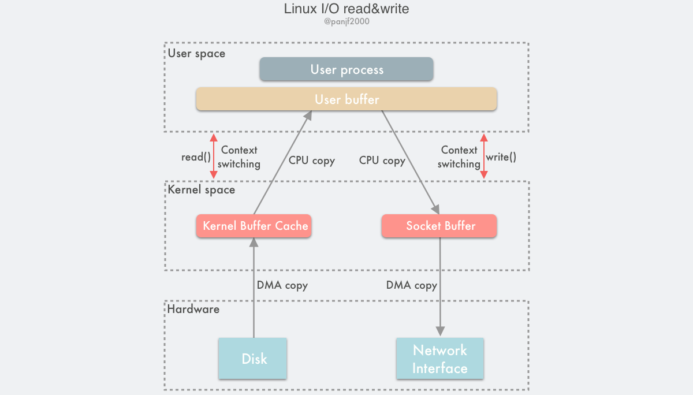

1. 用户进程调用 `read()` 系统调用，从用户态陷入内核态；
2. DMA 控制器将数据从硬盘拷贝到内核缓冲区，同时对 CPU 发出一个中断信号；
3. CPU 收到中断信号之后启动中断程序把数据从内核空间的缓冲区复制到用户空间的缓冲区；
4. `read()` 系统调用返回，上下文从内核态切换回用户态；
5. 用户进程调用 `write()` 系统调用，再一次从用户态陷入内核态；
6. CPU 将用户空间的缓冲区上的数据复制到内核空间的缓冲区，同时触发 DMA 控制器；
7. DMA 将内核空间的缓冲区上的数据复制到网卡；
8. `write()` 返回，上下文从内核态切换回用户态。

可以看到一共触发了 4 次用户态和内核态的上下文切换，2 次 DMA 拷贝，2 次 CPU 拷贝，加起来一共 4 次拷贝操作。

# 总结

Linux I/O 栈的七层结构如下：

1. 虚拟文件系统层
2. Page Cache 层
3. 映射层
4. 通用块层
5. I/O 调度层
6. 块设备驱动层
7. 块设备硬件层

三大基本 I/O 模式：

- 轮询 I/O
- 中断 I/O
- DMA I/O

了解用户程序中一个简单的 I/O 操作，在操作系统层面和硬件层面是如何运转的。最后介绍了传统 I/O 流程，涉及了多少次 CPU 拷贝、多少次 DMA 拷贝，结合三大 I/O 模式，为学习零拷贝 (Zero-Copy) 做铺垫。

# 参考

https://www.thomas-krenn.com/en/wiki/Linux_Storage_Stack_Diagram
https://strikefreedom.top/archives/linux-io-stack-and-zero-copy#linux-io-stack