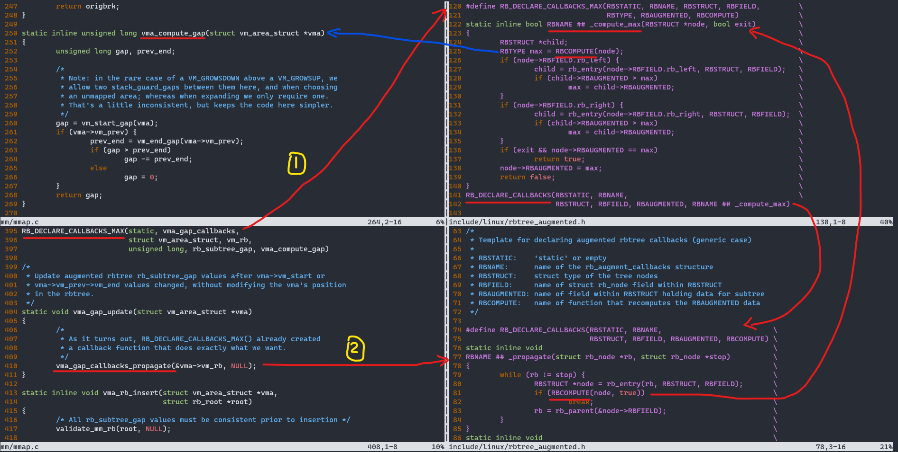

## 概述

mmap() 可以分为四大类，如下：

* 私有匿名映射
* 共享匿名映射
* 私有文件映射
* 共享文件映射 == shm

下面以 私有匿名映射 为例子，进行讲解

函数原型:

```c
#include <sys/mman.h>

void *mmap(void *addr, size_t length, int prot, int flags,
           int fd, off_t offset);
int munmap(void *addr, size_t length);
```

例子：

```c
#include <stdio.h>
#include <sys/mman.h>

int main(int argc, char *argv[])
{
	char *buf = mmap(NULL, 4096, PROT_READ | PROT_WRITE, MAP_PRIVATE | MAP_ANONYMOUS, -1, 0);
	*buf = 0x11;
	printf("buf 0x%x\n", *buf);

	munmap(buf, 4096);

	return 0;
}
```

调用流程：用户空间接口 ~ 系统调用接口

```bash
$ strace ./a.out
mmap(NULL, 4096, PROT_READ|PROT_WRITE, MAP_PRIVATE|MAP_ANONYMOUS, -1, 0) = 0x7f0b1599a000
write(1, "buf 0x11\n", 9buf 0x11
)               = 9
munmap(0x7f0b1599a000, 4096)            = 0
```

调用流程：系统调用接口 ~ 内核空间

```c
/* user space ->    kernel space           : file */
mmap()        -> SYSCALL_DEFINE6(mmap      : arch/x86/kernel/sys_x86_64.c
                       |                     arch/arm64/kernel/sys.c
                 ksys_mmap_pgoff()         : mm/mmap.c
munmap()      -> SYSCALL_DEFINE2(munmap    : mm/mmap.c
```

## 详细函数调用关系

```c
SYSCALL_DEFINE6(mmap
    ksys_mmap_pgoff()
        vm_mmap_pgoff()
            do_mmap()
                get_unmapped_area()
                    arch_get_unmapped_area_topdown()
                        generic_get_unmapped_area_topdown()
                            vm_unmapped_area()
                                unmapped_area_topdown()
                mmap_region()
                    munmap_vma_range()
                        find_vma_links()
                    vma_merge() -> return
                    vm_area_alloc()
                    vm_get_page_prot()
                    vma_link()
                        __vma_link()
                            __vma_link_list()
                            __vma_link_rb()
                                rb_link_node()
                                vma_gap_update()
                                vma_rb_insert()
            mm_populate()
```

do_mmap() 调用 get_unmapped_area() 查找空闲的虚拟地址空间，mmap_region() 将空闲的
虚拟地址空间 合并到旧VMA 或 创建新VMA并且加入到链表与红黑树中

## 详细函数解析

* unmapped_area_topdown()

查找 [gap_start, gap_end) 区域 满足 length 大小

```
+------------+ TASK_SIZE
|            |
+------------+ DEFAULT_MAP_WINDOW
|            |
|            |
|            |
+------------+ TASK_UNMAPPED_BASE
|            |
+------------+ mmap_min_addr
|            |
+------------+ 0x0
```

从 top to down 进行分配虚拟地址空间，
先在 [mmap_min_addr, TASK_UNMAPPED_BASE) 区域进行查找，
如果失败，
再在 [TASK_UNMAPPED_BASE, DEFAULT_MAP_WINDOW) 区域进行查找。
原理是通过判断 length, mm.vma.rb_subtree_gap 的大小

* vm_get_page_prot()

> https://blog.csdn.net/lingshengxueyuan/article/details/117562779

以 vma.vm_flags 为 index, 获得 protection_map[index] 是对应的页表权限，
存储在vma->vm_page_prot，但是 [VM_WRITE | VM_READ] = PAGE_READONLY, 为什么？
这样做的好处，在第一次操作是 read 时，在 page fault 中，
直接将对应 entry 设置成 vma->vm_page_prot，read-only 权限，映射到 zero-page 中。

如果进行 write 操作，再进一次 page fault，如果 vma.vm_flags 包含 VM_WRITE，
将对应 entry 设置成 write 权限

* vma_merge()

判断 [addr, addr + len) 区域能够合并到上一个VMA 或 下一个VMA中，存在 8 种情况，
如下：

```
     AAAA             AAAA                   AAAA
    PPPPPPNNNNNN    PPPPPPNNNNNN       PPPPPPNNNNNN
    cannot merge    might become       might become
                    PPNNNNNNNNNN       PPPPPPPPPPNN
                    case 4 below       case 5 below

                        AAAA               AAAA
                    PPPP    NNNN       PPPPNNNNXXXX
                    might become       might become
                    PPPPPPPPPPPP 1 or  PPPPPPPPPPPP 6 or
                    PPPPPPPPNNNN 2 or  PPPPPPPPXXXX 7 or
                    PPPPNNNNNNNN 3     PPPPXXXXXXXX 8
```

mmap(), brk() or mremap() 可能会调用 vma_merge()

* vma_gap_update()

初始化 vma.rb_subtree_gap



```c
/**
 *              P
 *            /   \
 *           L     R
 *            \
 *             T
 *
 * +---------------------------------------+
 * | G1 | L | G2 | T |   G3   | P | G4 | R |
 * +---------------------------------------+
 */
RB_DECLARE_CALLBACKS_MAX(static, vma_gap_callbacks,
			 struct vm_area_struct, vm_rb,
			 unsigned long, rb_subtree_gap, vma_compute_gap)

vma_gap_update()
    vma_gap_callbacks_propagate()
        vma_gap_callbacks_compute_max()
            vma_compute_gap()         ：距离最近的前一个VMA与当前VMA的gap，如上图 G3
            vma->vm_rb.rb_left        ：当前VMA与左子VMA的gap
            vma->vm_rb.rb_right       ：当前VMA与右子VMA的gap
            vma->rb_subtree_gap = max ：取三者中的最大值
```

为什么需要计算距离最近的前一个VMA与当前VMA的gap，如上图 G3？

当 `G3 > L.rb_subtree_gap (G1 or G2)` 并且 `G3 > R.rb_subtree_gap (G4)`，
`P.rb_subtree_gap = G3`。如果没有 G3 参与计算，会丢失此空闲虚拟地址空间。

## 零散知识点

calc_vm_prot_bits()/alc_vm_flag_bits() 将 mmap prot (PROT_XXX) 权限,
mmap flags (MAP_XXX) 标志转换成 vm_flags (VM_XXX) 标志

当 mmap flags 没有 MAP_FIXED 标志时，指定的虚拟地址 vaddr 有最低值要求，必须大于等于4096。
为什么？因为 Linux 默认将虚拟地址 NULL 当成 panic，所以不能对虚拟地址 NULL 进行映射。
又因为映射的虚拟地址必须4096对齐，所以虚拟地址必须大于等于4096

一个进程的 VMA 个数必须小于 sysctl_max_map_count。
为什么？ ELF 格式的 section 个数限制，最大值为 unsigned short。
详细解释：`include/linux/mm.h` 的 179 ~ 196 行

mmap len 必须小于 TASK_SIZE，即 小于最大的进程虚拟地址

mm.vma.rb_subtree_gap : 距离最近的前一个VMA与当前VMA的gap，以及当前VMA与左右子VMA的gap，
取三者中的最大值。

mm.highest_vm_end : 最高VMA对应的结束地址

mm.mmap_base : 虚拟地址空间中用于映射的起始地址
