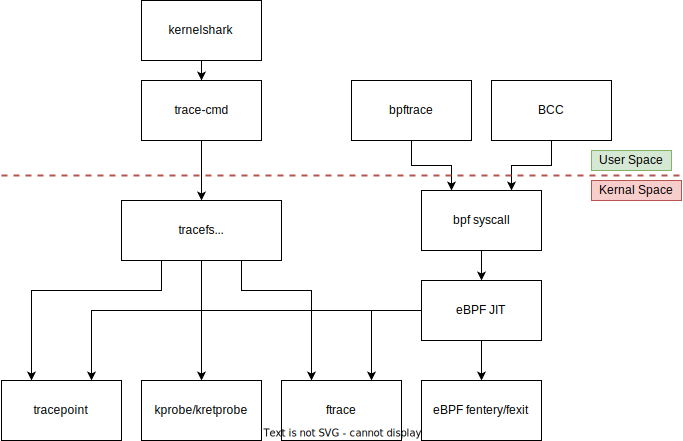

## 简介



静态探针，`Tracepoint`：预先在目标函数调用钩子函数

动态探针，`Kprobe`：在运行时，将目标函数的某一个函数对应的指令替换成钩子函数

`Ftrace`：在编译时，在目标函数入口处加入两个 `NOP` 指令，
在启动初始化过程中，将 第一个 `NOP` 指令 替换成 `MOV X9, LR` 指令，
最后使能trace功能时，将第二个 `NOP` 指令替换成钩子函数

## Tracepoint原理

```
Documentation/trace/tracepoints.rst
Documentation/trace/tracepoint-analysis.rst
Documentation/trace/events.rst
```

## Kprobe原理

`kprobe` 可以用来跟踪内核函数中某一条指令在运行前和运行后的情况。

我们只需在 `kprobe` 模块中定义好指令执行前的回调函数 `pre_handler()` 和执行后的回调函数 `post_handler()`，
那么内核将会在被跟踪的指令执行前调用 `pre_handler()` 函数，并且在指令执行后调用  `post_handler()` 函数

具体流程如下：



当使用 `kprobe` 来跟踪内核函数的某条指令时，`kprobe` 首先会把要追踪的指令保存起来，
然后把要追踪的指令替换成 `INT3` 指令，当内核执行到这条指令时，将会触发 `do_int3()` 异常处理例程

`do_int3()` 异常处理流程为：首先调用 `kprobe` 模块的 `pre_handler()` 回调函数，
然后将 CPU 设置为单步调试模式，接着从异常处理例程中返回，并且执行原来的指令。

由于设置了单步调试模式，当执行完原来的指令后，将会触发 `debug` 异常（这是 `Intel x86 CPU` 的一个特性）

内核将会执行 `debug` 异常处理例程 `do_debug()`，而 `do_debug()` 异常处理例程将会
调用 `kprobe` 模块的 `post_handler()` 回调函数

## Ftrace

> Base aarch64
>
> Documentation/trace/ftrace-design.rst
>
> Documentation/trace/ftrace.rst



`GCC` 编译时加上 `-fpatchable-function-entry=2` 参数，编译后，自动在目标函数入口处加入两个 `NOP` 指令，
同时将第一条 `NOP` 指令所在的地址 存储在 `__patchable_function_entries` 段中，链接时，将所有 `.o` 的
`__patchable_function_entries` 段 整合存储到 `[__start_mcount_loc, __stop_mcount_loc]` 区域中，
即 `[__start_mcount_loc, __stop_mcount_loc]` 区域 存储 所有函数入口处的第一条 `NOP` 指令所在的地址

在启动初始化过程中，`start_kernel() -> ftrace_init()`，从区域 `[__start_mcount_loc, __stop_mcount_loc]` 中
获得所有函数入口处的第二条 `NOP` 指令所在的地址 保存在 `struct dyn_ftrace->ip` 中，
其中 `struct dyn_ftrace` 所占内存是通过页分配器动态分配出来的，
同时调用 `ftrace_init_nop()` 将 第一个 `NOP` 指令 替换成 `MOV X9, LR` 指令

最后使能trace功能中，通过对 `/sys/kernel/traing/current_tracer` 配置使用哪一种 `tracer` 时，
将调用 `ftrace_make_call()` 将第二个 `NOP` 指令替换成 `BL ftrace_caller` 指令来调用钩子函数 ,
`ftrace_caller()` 会根据 `/sys/kernel/traing/xxx` 的配置，调用用户注册的 `trace` 函数
